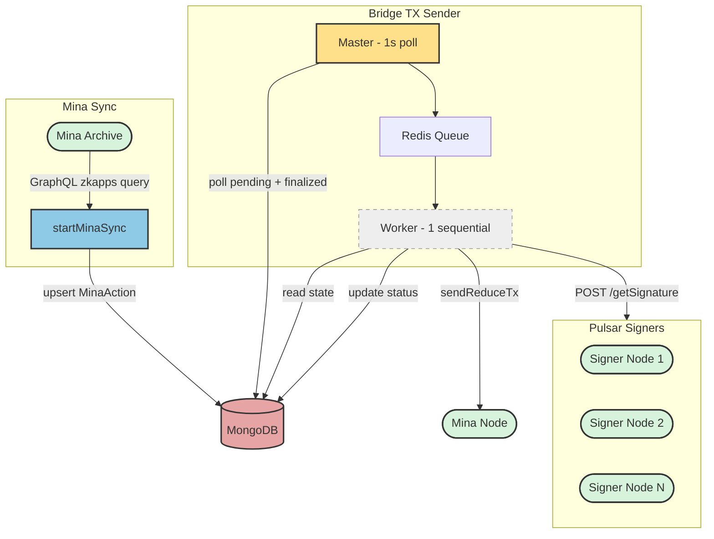
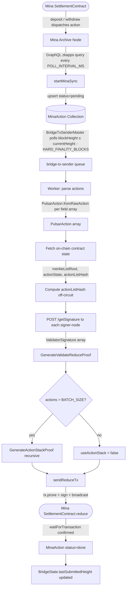
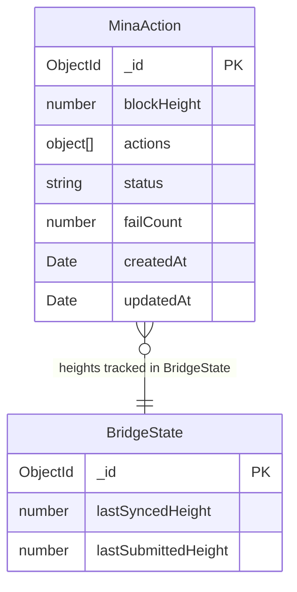
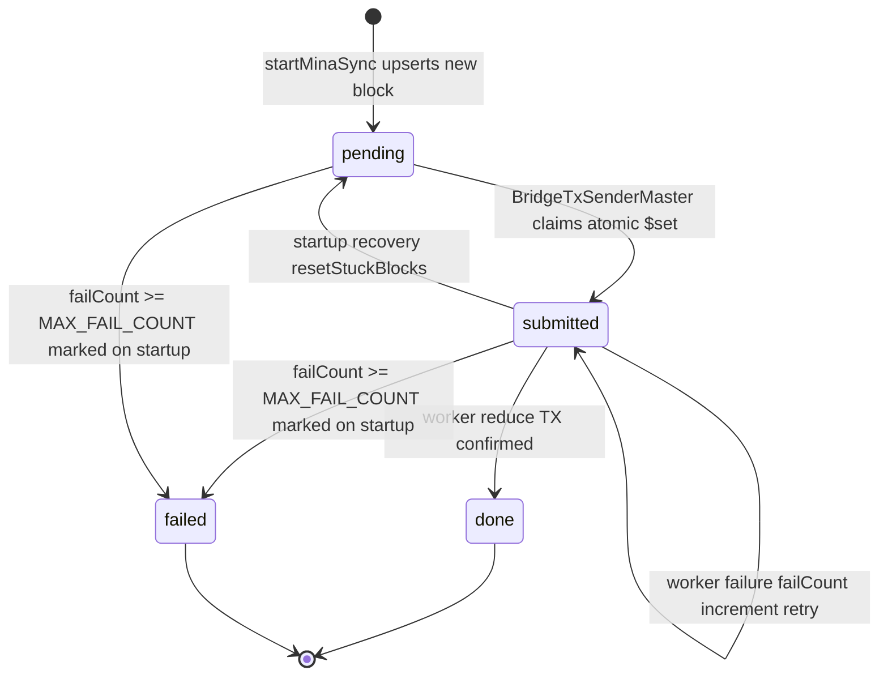

# Bridge Node

## Table of Contents

1. [Overview](#overview)
2. [System Architecture](#system-architecture)
3. [Modules](#modules)
    - [Database](#database)
    - [Mina](#mina)
    - [Pulsar](#pulsar)
    - [Bridge TX Sender](#bridge-tx-sender)
4. [End-to-End Flow](#end-to-end-flow)
5. [Data Models & ERD](#data-models--erd)
6. [State Machine](#state-machine)
7. [ZK Proof Pipeline](#zk-proof-pipeline)
8. [Failure Handling & Recovery](#failure-handling--recovery)
9. [Startup Sequence](#startup-sequence)
10. [Developer Notes](#developer-notes)

---

## Overview

`bridge` is the off-chain node that relays deposit and withdrawal actions from the Mina `SettlementContract` into the Pulsar blockchain. It watches for new actions dispatched to the contract, waits for Mina's hard finality window, collects validator signatures, generates zero-knowledge proofs, and submits a `reduce()` transaction back to the Mina contract to confirm the batch.

**Key responsibilities:**

- Syncing Mina action data from the Archive node via GraphQL
- Waiting for `HARD_FINALITY_BLOCKS` Mina blocks before processing
- Collecting validator signatures from Pulsar signer-nodes (HTTP REST)
- Generating `ValidateReduceProof` and (if needed) `ActionStackProof` via `o1js`
- Submitting the `SettlementContract.reduce()` transaction to Mina
- Tracking all progress and failure state in MongoDB
- Processing blocks strictly in order with a single sequential BullMQ worker

---

## System Architecture



**External service dependencies:**

| Service              | Purpose                                              | Protocol        |
| -------------------- | ---------------------------------------------------- | --------------- |
| Mina Archive Node    | Fetch dispatched actions grouped by block height     | GraphQL (HTTP)  |
| Mina Node            | Submit `reduce()` TX, read contract state            | o1js Mina RPC   |
| Pulsar Signer Nodes  | Collect validator signatures for each action batch   | HTTP REST       |
| MongoDB              | Persistent state for actions and bridge progress     | Mongoose ODM    |
| Redis                | BullMQ job queue backing store                       | ioredis         |

---

## Modules

### Database

**`src/db/`**

Two MongoDB collections:

| Collection    | Purpose                                                                        |
| ------------- | ------------------------------------------------------------------------------ |
| `MinaAction`  | Dispatched actions per block height, with lifecycle status and failure counter |
| `BridgeState` | Single document tracking sync cursor and last submitted height                 |

---

### Mina

**`src/services/mina/`**

Three files covering all Mina interaction:

**`client.ts`** — Initializes and holds the `MinaClientContext`. All other Mina service functions receive this context as a parameter. Provides `fetchActionsByHeight` which queries the Archive node via the `zkapps` GraphQL endpoint, groups results by `blockHeight`, and returns raw field arrays (`string[][]`) for each block.

**`sync.ts`** — Runs the background poll loop. On each tick it compares the latest Mina chain height against `BridgeState.lastSyncedHeight`, fetches all actions in that range from the Archive, upserts them as `MinaAction` documents, and advances the sync cursor.

**`txSender.ts`** — Implements `sendReduceTx`. Builds the `SettlementContract.reduce()` transaction, calls `tx.prove()`, then enters a retry loop (up to `MAX_RETRY` attempts) where it refreshes the sender nonce, signs, broadcasts, and waits for on-chain inclusion using `waitForTransaction`.

---

### Pulsar

**`src/services/pulsar/`**

**`client.ts`** — Sends a `POST /getSignature` request to each configured Pulsar signer-node endpoint in parallel (`PULSAR_VALIDATOR_ENDPOINTS`). Collects responses, logs per-validator failures without aborting the whole batch, and returns a `ValidatorSignature[]` array containing the o1js `PublicKey` and `Signature` objects for each responding validator.

---

### Bridge TX Sender

**`src/workers/bridge-tx-sender/`**

Follows the same **Master / Worker pattern** used in the prover node:

```
┌─────────────────────────────────────────────┐
│         BridgeTxSenderMaster (1s poll)      │
│  - Skips if queue already has a waiting job │
│  - Finds next sequential pending height     │
│  - Checks hard finality window              │
│  - Sets status = submitted                  │
│  - Enqueues job to BullMQ                   │
└────────────────────┬────────────────────────┘
                     │ add job
              ┌──────▼──────┐
              │ Redis Queue │  (BullMQ)
              └──────┬──────┘
                     │ consume job
┌────────────────────▼─────────────────────────┐
│            Worker — 1 sequential             │
│  - Parses raw actions → PulsarAction[]       │
│  - Fetches contract state (merkleRoot, etc.) │
│  - Computes actionListHash off-circuit       │
│  - Collects validator signatures             │
│  - Generates ValidateReduceProof             │
│  - Generates ActionStackProof                │
│  - Sends SettlementContract.reduce() TX      │
│  - Marks MinaAction done                     │
└──────────────────────────────────────────────┘
```

**Key timing constants:**

| Constant                   | Purpose                                                         |
| -------------------------- | --------------------------------------------------------------- |
| `HARD_FINALITY_BLOCKS`     | Minimum Mina blocks to wait before processing a height (32)     |
| `MASTER_SLEEP_INTERVAL_MS` | Master poll frequency when idle (1 s)                           |
| `WORKER_TIMEOUT_MS`        | BullMQ job lock duration; also used as failure cooldown (5 min) |
| `STALLED_INTERVAL_MS`      | BullMQ stall detection frequency (5 s)                          |
| `MAX_FAIL_COUNT`           | Max failures before a block is permanently marked failed (3)    |

---

## End-to-End Flow



---

## Data Models & ERD



### Field notes

**MinaAction** — `blockHeight` is unique. `actions` stores raw field arrays (`string[][]`) exactly as returned by the Mina Archive GraphQL response; no transformation is applied at sync time. `status` drives the master's query filter. `failCount` increments on each worker failure; `timeoutAt` is not stored separately — BullMQ handles the lock duration via `lockDurationMs`.

**BridgeState** — Single upserted document (created on first read if missing). `lastSyncedHeight` is the Archive cursor — how far the sync loop has read. `lastSubmittedHeight` is the last height whose reduce TX was confirmed; the master always targets `lastSubmittedHeight + 1`.

---

## State Machine

### MinaAction.status



---

## ZK Proof Pipeline

The worker generates two proofs before submitting the reduce transaction.

### ValidateReduceProof

Proves that a quorum of validators has signed the `(merkleListRoot, actionListHash)` pair. The `actionListHash` is computed off-circuit in the worker to mirror exactly what `SettlementContract.reduce()` will compute on-circuit:

```
startHash = contract.actionListHash.get()   // on-chain state before this batch

for each action in batch where mask[i] = true and not dummy:
    startHash = Poseidon.hash([startHash, action.type, ...account.toFields(), action.amount, ...pulsarAuth.toFields()])

publicInput = ValidateReducePublicInput { merkleListRoot, actionListHash: startHash }
```

The contract asserts `actionListHash === validateReduceProof.publicInput.actionListHash` in `reduce()`. If the off-circuit computation diverges from the on-circuit loop, the assertion fails and the TX is rejected.

### ActionStackProof

Proves the integrity of the full action list when it exceeds `BATCH_SIZE`. The proof is recursive — `ActionStackProgram.proveBase` handles the first chunk, then `ActionStackProgram.proveRecursive` is called once per additional `ACTION_QUEUE_SIZE` chunk. The contract uses `actionStackProof.publicInput` (the expected `actionState`) to verify that the correct actions were processed without replaying each one in the circuit.

When `actions.length === 0` or the list fits in a single batch, `useActionStack = false` and the proof is still generated (as a base proof) but not verified by the contract (`verifyIf(useActionStack)` short-circuits).

---

## Failure Handling & Recovery

### Worker failures

Each worker failure increments `MinaAction.failCount`. BullMQ's `lockDurationMs` (`WORKER_TIMEOUT_MS = 5 min`) gives the job a cooldown window between retries. There is no explicit `timeoutAt` field in MongoDB; the master always queries `status = pending` and BullMQ handles re-queuing on lock expiry.

### Startup recovery

On every startup, before any processing begins:

| Stuck state                      | Cause                           | Reset to  |
| -------------------------------- | ------------------------------- | --------- |
| `MinaAction.status = submitted`  | Worker crashed mid-job          | `pending` |

### Max fail count

Any `MinaAction` with `failCount >= MAX_FAIL_COUNT` that is not already `done` is permanently marked `failed` on startup. Failed blocks are excluded from all master queries and will not be retried.

### TX send retries

`sendReduceTx` has its own inner retry loop (up to `MAX_RETRY` attempts, separate from BullMQ retries). On each attempt it refreshes the sender nonce from the chain, re-signs the already-proved transaction, and retries the broadcast. This handles transient node failures or nonce staleness without re-running the expensive `tx.prove()` step.

---

## Startup Sequence

On start, `main()` in `index.ts`:

1. Connects to MongoDB
2. Runs startup procedures (`runStartup`):
   - Obliterates the `bridge-tx-sender` BullMQ queue (clears stale jobs)
   - Resets any `submitted` blocks back to `pending`
   - Permanently marks blocks with `failCount >= MAX_FAIL_COUNT` as `failed`
3. Starts `startMinaSync()` — the background Archive poll loop
4. Starts `BridgeTxSenderMaster` — the sequential reduce TX pipeline

The `BridgeTxSenderMaster` also initializes its own `MinaClientContext` inside `onStartup()`, which fetches the contract account from the Mina node and sets up the o1js network connection.

The sync loop and the master run independently and do not share a context. The worker process lazily initializes its own `MinaClientContext` on first job.

---

## Developer Notes

### Sequential worker is mandatory

`SettlementContract.reduce()` advances the contract's `actionState`. If two reduce transactions were sent in parallel, the second would fail because the contract's action state would have already been updated by the first. The single sequential worker is not a performance trade-off — it is a correctness requirement.

The master enforces this by checking `bridgeTxSenderQ.getJobCounts()` before enqueuing. If there is already a waiting or active job, the master sleeps and exits the current tick without adding another job.

### actionListHash must mirror the contract exactly

`computeActionListHash` in `worker.ts` replicates the loop inside `SettlementContract.reduce()` line-for-line. The inputs to `Poseidon.hash` must be in the exact same order, the `shouldProcess` predicate must be identical, and the starting hash must come from the contract's current on-chain `actionListHash` state (not a hardcoded zero or `emptyActionListHash`).

Any divergence between the off-circuit computation and the on-circuit loop will cause `actionListHash.assertEquals(validateReduceProof.publicInput.actionListHash)` to fail in the contract, and the reduce TX will be rejected.

### Raw actions are stored as-is from the Archive

The sync loop does not parse or transform actions. It stores the raw `string[][]` field arrays directly in MongoDB. The worker converts them to `PulsarAction` structs via `PulsarAction.fromRawAction(rawFields)` at processing time. This keeps the sync loop simple and stateless — parsing errors become worker failures, not sync failures.

### Nonce refresh between prove and send

`tx.prove()` can take several minutes. By the time it completes, the sender's nonce on-chain may have advanced (e.g., from a manually submitted TX or a concurrent process). `sendReduceTx` handles this by fetching the latest nonce from the chain, patching it into the proved transaction JSON, reconstructing the transaction via `Transaction.fromJSON`, and setting `lazyAuthorization` before re-signing. This avoids having to re-run the full prove step just because of a nonce mismatch.

### Validator endpoints are configured at runtime

`PULSAR_VALIDATOR_ENDPOINTS` is a comma-separated list of signer-node base URLs. The Pulsar client fans out to all endpoints in parallel and collects as many signatures as respond successfully. Individual validator failures are logged as warnings — not errors — and do not abort the batch, as long as enough signatures are collected for the quorum threshold (`ValidateReduceProgram` enforces this inside the ZK circuit).

### contracts/build/src imports

All contract types and utilities are imported from `contracts/build/src/` (the compiled output), not from `contracts/src/` (TypeScript source). This is required because bridge's `tsconfig.json` has `rootDir: "."` — TypeScript will not allow importing `.ts` files from outside the bridge directory. Whenever contracts change, run `npm run build` inside `contracts/` before starting or type-checking the bridge.
