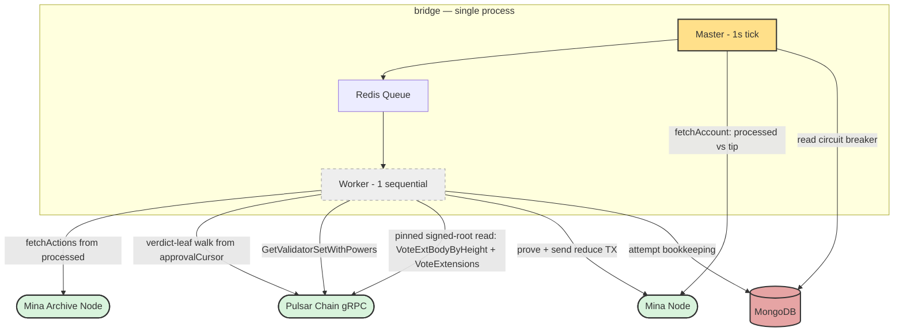
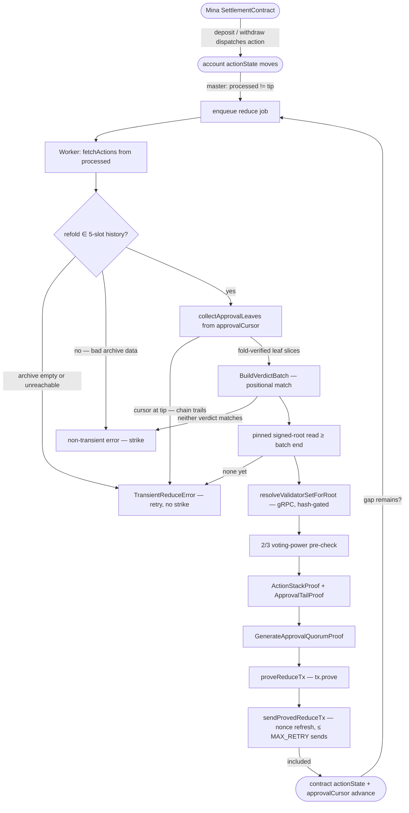
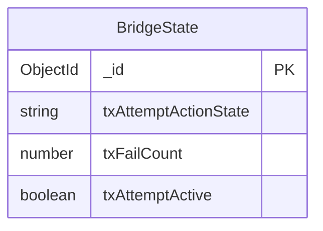
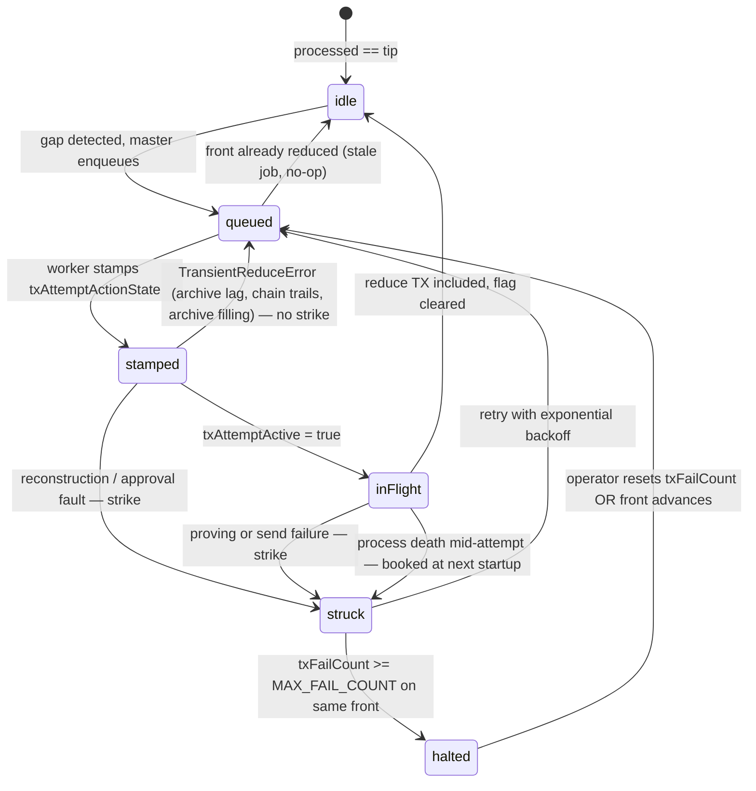

# Bridge Node

## Table of Contents

1. [Overview](#overview)
2. [System Architecture](#system-architecture)
3. [Modules](#modules)
    - [Database](#database)
    - [Mina](#mina)
    - [Pulsar](#pulsar)
    - [Bridge TX Sender](#bridge-tx-sender)
4. [End-to-End Flow](#end-to-end-flow)
5. [Data Models & ERD](#data-models--erd)
6. [State Machine](#state-machine)
7. [ZK Proof Pipeline](#zk-proof-pipeline)
8. [Approval Flow](#approval-flow)
9. [Failure Handling & Recovery](#failure-handling--recovery)
10. [Startup Sequence](#startup-sequence)
11. [Developer Notes](#developer-notes)

---

## Overview

`bridge` is the off-chain node that folds deposit and withdrawal actions dispatched to the Mina `SettlementContract` into the contract's state. It reads the contract's pending action queue directly from the chain, reads the Pulsar chain's own verdicts on those actions (the v2 verdict-leaf chain) and the vote-extension signatures validators already produce every block, generates zero-knowledge proofs, and submits a `reduce()` transaction that advances the contract's processed pointer. It does not touch the settlement flow — that is the prover's job.

**The one design rule: the chain is the source of truth.** The pending work is the gap between two on-chain values read from the same `fetchAccount` snapshot:

| Value | Where | Meaning |
| --- | --- | --- |
| processed pointer | contract state slot 0 (`actionState`) | fold of every action the contract has **reduced** |
| queue tip | account `actionState[0]` (Mina stores 5) | fold of every action ever **dispatched** |

`processed == tip` → nothing to do. `processed != tip` → the difference IS the pending queue, fetched from the Archive with `fetchActions(contract, processed)` on every attempt. There is no work list in MongoDB, no per-block bookkeeping, and no finality delay before reducing: a reorged action makes the rebuilt fold disagree with the surviving branch, the contract rejects the TX, and the next attempt re-derives everything. Crash recovery is the same mechanism — whatever landed already moved `processed`.

The same rule holds for approvals: the contract's `approvalCursor` (state slot 4) is a prefix fold of the Pulsar chain's cumulative verdict-leaf chain, and the worker walks the chain's own published leaf list from exactly that cursor on every attempt. The bridge holds no opinion about which action is valid — it relays the chain's adjudication and proves a validator quorum signed it.

One archive quirk matters here: the archive can only slice action history at **block boundaries**, while `reduce` consumes `BATCH_SIZE` actions regardless of block alignment. When `processed` lands mid-block, the ranged query returns empty even though actions are pending; `fetchActions` (contracts `utils/fetch.ts`) then refetches the full history and slices it locally on the per-action hash chain. The worker's refold cross-check validates the slice, so a bad cut can never reach proving.

**Key responsibilities:**

- Detecting pending actions from the contract's on-chain action-state gap
- Walking the Pulsar chain's verdict-leaf chain from the contract's `approvalCursor` (gRPC, fold-verified)
- Building the batch, verdicts and stack positionally via the contracts package (`BuildVerdictBatch`)
- Resolving the ordered validator set (with powers) from the Pulsar chain (gRPC), hash-gated against the on-chain `merkleListRoot`
- Generating `ApprovalTailProof` → `ApprovalQuorumProof` and (if needed) `ActionStackProof` via `o1js`
- Submitting the `SettlementContract.reduce()` transaction to Mina
- Tracking attempt/failure bookkeeping in MongoDB (`BridgeState`, a singleton)
- Processing the queue front strictly in order with a single sequential BullMQ worker

---

## System Architecture


```mermaid
graph TD
    classDef db fill:#e6a4a4,stroke:#333,stroke-width:2px
    classDef processor fill:#ffe08a,stroke:#333,stroke-width:2px
    classDef worker fill:#eee,stroke:#999,stroke-dasharray: 5 5
    classDef external fill:#d8f3dc,stroke:#333,stroke-width:2px

    subgraph Bridge [bridge — single process]
        master[Master - 1s tick] --> queue[Redis Queue]
        queue --> worker1[Worker - 1 sequential]
    end

    Mina([Mina Node])
    Archive([Mina Archive Node])
    ChainGrpc([Pulsar Chain gRPC])
    mongoDB[(MongoDB)]

    master -->|fetchAccount: processed vs tip| Mina
    master -->|read circuit breaker| mongoDB
    worker1 -->|fetchActions from processed| Archive
    worker1 -->|verdict-leaf walk from approvalCursor| ChainGrpc
    worker1 -->|GetValidatorSetWithPowers| ChainGrpc
    worker1 -->|pinned signed-root read: VoteExtBodyByHeight + VoteExtensions| ChainGrpc
    worker1 -->|prove + send reduce TX| Mina
    worker1 -->|attempt bookkeeping| mongoDB

    class Mina,Archive,ChainGrpc external
    class mongoDB db
    class master processor
    class worker1 worker
```

**External service dependencies:**

| Service              | Purpose                                                                                          | Protocol        |
| -------------------- | ------------------------------------------------------------------------------------------------ | --------------- |
| Mina Node            | Read contract + account action states, submit `reduce()` TX                                      | o1js Mina RPC   |
| Mina Archive Node    | Fetch the pending action queue from the processed pointer                                        | GraphQL (HTTP)  |
| Pulsar Chain (gRPC)  | The single chain dependency: validator set with powers; signed-root reads; verdict leaves + approval root | gRPC            |
| MongoDB              | Attempt/failure bookkeeping (`BridgeState` singleton)                                            | Mongoose ODM    |
| Redis                | BullMQ job queue backing store                                                                   | ioredis         |

There are no Pulsar signer nodes and no `/getSignature` protocol: the only signatures the bridge ever handles are the vote-extension signatures validators already produce in CometBFT consensus, read from the chain itself.

---

## Modules

### Database

**`src/db/`**

One MongoDB collection:

| Collection    | Purpose                                                                      |
| ------------- | ---------------------------------------------------------------------------- |
| `BridgeState` | Single document: which queue front is being attempted, how often it failed, and whether an attempt is in flight |

`BridgeState` is the operational memory the chain cannot hold for us. Signed roots need no memory of ours at all: the chain's LIVE vote store is overwritten every block (`pre_blocker.go` clears it), but votepersistence is ordinary chain state, so every past block's signature set stays readable through the standard historical state query for as long as the node retains that version. Correctness never needs more than the LATEST signed root — every block re-signs the cumulative actions root — so the worker reads on demand: a pinned read at the height covering the batch end (shortest tail) with the latest root as fallback. A missed read only lengthens a tail; it never breaks correctness. Everything else (pending actions, verdicts, progress) is re-derived from the chains on every attempt.

---

### Mina

**`src/services/mina/`**

**`client.ts`** — Initializes and holds the `MinaClientContext`. `refreshContractState` captures the contract's `zkappState` AND the account's five stored action states (`actionStateHistory`) from the same `fetchAccount` snapshot; getters expose the state slots by declaration order (0=actionState, 1=merkleListRoot, 2=stateRoot, 3=blockHeight — a PULSAR height, 4=approvalCursor — the prefix fold of the chain's v2 verdict-leaf chain this contract has consumed).

**`txSender.ts`** — Split into `proveReduceTx` (builds the `reduce()` transaction and runs the expensive `tx.prove()`, returning serialized TX JSON) and `sendProvedReduceTx` (retry loop of up to `MAX_RETRY` attempts: refresh nonce, re-sign the already-proved JSON, broadcast, wait for inclusion via `waitForTransaction`). The split means a nonce or broadcast failure never re-pays the proving cost.

---

### Pulsar

**`src/services/pulsar/`**

**`validActions.ts`** — The verdict-leaf walk. Holds the gRPC wire spec in one block (the single adjust point if the chain moves it), decodes decimal field elements and quoted int64s strictly, and exposes `collectApprovalLeaves(approvalCursor)`: the ordered slice of v2 verdict leaves extending the contract's cursor to the chain's tip, grouped per push. Every push is fold-verified against the on-chain `actions_reduced_root` transition before it contributes leaves — see [Approval Flow](#approval-flow).

**`voteExtensions.ts`** — On-demand signed-root reads. `findSignedRootAtOrBeyond(coveringHeight, validatorSetRoot)` tries a pinned read at the covering height first (oldest usable root — shortest approval tail), then falls back to the latest signed root (`tip − VOTE_EXT_PERSISTENCE_LAG`), which always exists while the chain is alive. A record is usable only if its signature window was not missed AND its body carries the contract's validator-set root — a root signed by any other set can never satisfy the quorum circuit. Fetching and byte→field conventions live in `pulsar-chain-client` (`fetchSignedVoteExtension`: `AbciQuery.VoteExtBodyByHeight(H+2)` + `VotePersistence.VoteExtensions` pinned at `H+3`), shared with the prover, so they exist exactly once.

**`validatorSet.ts`** — Resolves the FULL ordered validator set (with powers) from the Pulsar chain over gRPC. Every candidate set is hash-gated: it is only returned if its leaf fold reproduces the contract's on-chain `merkleListRoot` (the leaf convention is single-sourced in `contracts/src/utils/validatorList.ts`). Verified sets are cached by root. `VALIDATOR_SET_OVERRIDE` feeds the same hash gate for environments without a chain.

---

### Bridge TX Sender

**`src/workers/bridge-tx-sender/`**

Follows the same **Master / Worker pattern** used in the prover node:

```
┌─────────────────────────────────────────────┐
│         BridgeTxSenderMaster (1s tick)      │
│  - Skips if queue already has a job         │
│  - fetchAccount: processed vs queue tip     │
│  - Equal → sleep (nothing pending)          │
│  - Circuit breaker tripped → halt tick      │
│  - Backoff if the front has strikes         │
│  - Enqueues { fromActionState } to BullMQ   │
└────────────────────┬────────────────────────┘
                     │ add job
              ┌──────▼──────┐
              │ Redis Queue │  (BullMQ)
              └──────┬──────┘
                     │ consume job
┌────────────────────▼─────────────────────────┐
│            Worker — 1 sequential             │
│  - Re-derives processed/tip from the chain   │
│  - Stamps attempt identity in BridgeState    │
│  - fetchActions + reconstruction cross-check │
│  - Verdict-leaf walk from approvalCursor     │
│  - BuildVerdictBatch (batch + verdicts)      │
│  - Pinned signed-root read (covering height) │
│  - Flags the attempt in-flight               │
│  - ActionStack + tail + quorum proofs        │
│  - Proves + sends the reduce() TX            │
│  - Clears the in-flight flag                 │
└──────────────────────────────────────────────┘
```

One job = one reduce over the FRONT of the queue. The master re-queues while a gap remains, so a backlog drains up to `BATCH_SIZE` actions per job. All chain reads (archive, leaf walk, signed-root lookup) happen BEFORE the in-flight flag flips on: the transient waits (chain trailing the queue, a missed signature window) must not read as an interrupted expensive attempt that startup would book as a strike.

**Key timing constants:**

| Constant                      | Purpose                                                          |
| ----------------------------- | ---------------------------------------------------------------- |
| `MASTER_SLEEP_INTERVAL_MS`    | Master tick frequency when idle (1 s)                            |
| `WORKER_TIMEOUT_MS`           | BullMQ job lock duration (45 min — covers proving plus 3 inclusion waits); `maxStalledCount: 0` fails a stalled job instead of silently replaying it |
| `STALLED_INTERVAL_MS`         | BullMQ stall detection frequency (30 s)                          |
| `MAX_FAIL_COUNT`              | Non-transient strikes per queue front before the master halts (3)|
| `CACHE_DIR`                   | o1js compile cache (`bridge/cache/`, shared SRS/Lagrange bases)  |

---

## End-to-End Flow


```mermaid
flowchart TD
    A([Mina SettlementContract]) -->|deposit / withdraw dispatches action| B([account actionState moves])

    B -->|master: processed != tip| C[enqueue reduce job]
    C --> D[Worker: fetchActions from processed]
    D --> E{refold ∈ 5-slot history?}
    E -->|archive empty or unreachable| Y[TransientReduceError — retry, no strike]
    E -->|no — bad archive data| X[non-transient error — strike]
    E -->|yes| F[collectApprovalLeaves from approvalCursor]

    F -->|cursor at tip — chain trails| Y
    F -->|fold-verified leaf slices| G[BuildVerdictBatch — positional match]
    G -->|neither verdict matches| X
    G --> H[pinned signed-root read ≥ batch end]
    H -->|none yet| Y
    H --> I[resolveValidatorSetForRoot — gRPC, hash-gated]
    I --> J[2/3 voting-power pre-check]
    J --> K[ActionStackProof + ApprovalTailProof]
    K --> L[GenerateApprovalQuorumProof]
    L --> M[proveReduceTx — tx.prove]
    M --> N[sendProvedReduceTx — nonce refresh, ≤ MAX_RETRY sends]
    N -->|included| O([contract actionState + approvalCursor advance])
    O -->|gap remains?| C
```

---

## Data Models & ERD


```mermaid
erDiagram
    BridgeState {
        ObjectId _id PK
        string txAttemptActionState
        number txFailCount
        boolean txAttemptActive
    }
```

### Field notes

**BridgeState** — Single upserted document (created on first read if missing). `txAttemptActionState` is the queue front (contract `actionState`) of the last attempt — the identity failures are charged to. `txFailCount` counts consecutive NON-transient failures against that same front and resets when the front advances. `txAttemptActive` is true while proving/sending is in flight; still true at boot means the previous attempt died mid-flight and is booked as a failure (deliberate restarts included — accepted, since the counter resets when the front advances).

Signed roots are deliberately NOT stored: they are read on demand from the chain's votepersistence state (`findSignedRootAtOrBeyond` in `services/pulsar/voteExtensions.ts` — a pinned read at the covering height, falling back to the latest signed root). The read filters by `nextValidatorSetHash`: the quorum circuit pins the signed body's set root to the contract's `merkleListRoot`, so after a validator-set rotation only roots re-signed under the newly settled root are usable, and rejecting stale roots before proving is what keeps reduce from failing in-circuit after minutes of proving.

---

## State Machine

### Reduce attempt lifecycle (per queue front)


```mermaid
stateDiagram-v2
    [*] --> idle : processed == tip
    idle --> queued : gap detected, master enqueues

    queued --> idle : front already reduced (stale job, no-op)
    queued --> stamped : worker stamps txAttemptActionState

    stamped --> queued : TransientReduceError (archive lag, chain trails, archive filling) — no strike
    stamped --> struck : reconstruction / approval fault — strike
    stamped --> inFlight : txAttemptActive = true

    inFlight --> idle : reduce TX included, flag cleared
    inFlight --> struck : proving or send failure — strike
    inFlight --> struck : process death mid-attempt — booked at next startup

    struck --> queued : retry with exponential backoff
    struck --> halted : txFailCount >= MAX_FAIL_COUNT on same front

    halted --> queued : operator resets txFailCount OR front advances
```

---

## ZK Proof Pipeline

The worker generates three proofs per reduce, but the contract still verifies exactly **two** (the Pickles limit): the tail proof is consumed *inside* the quorum proof, not by the contract. All witnesses are produced by the contracts package (`BuildVerdictBatch`, `GenerateApprovalTailProof`, `GenerateApprovalQuorumProof`, `GenerateActionStackProof`) — the bridge does not reimplement any circuit arithmetic.

### ApprovalTailProof

Folds the chain's verdict leaves from the batch-end approval cursor (`publicInput` = anchor) to a terminal root (`publicOutput`), `APPROVAL_TAIL_CHUNK = 128` leaves per layer, recursion for longer tails. Every recursion layer re-exposes the ORIGINAL anchor — the same anchor discipline as `ActionStackProgram`. The leaf entries are unconstrained witness fields; they need no constraining because the anchor is pinned below by the contract and the terminal root is pinned above by a quorum signature, so by collision resistance the only sequence connecting them is the chain's real one. **An empty tail is a real base proof over an all-dummy queue** (`publicOutput == publicInput`) — no dummy proof, no conditional verification.

### ApprovalQuorumProof

Proves that ≥2/3 of the validator set's voting power signed one vote-extension body — the message Pulsar validators ALREADY sign every block in `ExtendVote` — and that the batch-end cursor extends to that body's signed `actionsReducedRoot`:

- `publicInput = { validatorSetRoot, cursorAfter }`; private inputs `[VoteExtBody, SignaturePublicKeyList, ApprovalTailProof]`.
- Verifies the tail proof, asserts `tailProof.publicInput == cursorAfter` and `tailProof.publicOutput == body.actionsReducedRoot`.
- Asserts `body.nextValidatorSetHash == validatorSetRoot` — and `reduce` pins `validatorSetRoot` to contract slot 1, so the signer set is authenticated against contract state, not prover claims.
- Per slot: `signature.verify(publicKey, [body.hash()])` accumulates power; the validator leaf fold across ALL `VALIDATOR_NUMBER` slots must equal `validatorSetRoot`; `signed·3 ≥ total·2`.

`VoteExtBody.hash()` (contracts `types/voteExtBody.ts`) is the single source of the signed formula, shared with the settle path's `Block` and pinned digit-for-digit by chain-generated signature vectors. The body's other fields (`stateRootHi/Lo`, `currentBlockHeight`) stay unconstrained witnesses — safe, because the Schnorr signature binds all body fields jointly into the one hashed element.

The signature list always carries the FULL ordered validator set: non-signers get the well-formed dummy signature `(r=1, s=1)`, which fails `signature.verify` in-circuit (contributing no voting power) while keeping the leaf fold equal to `merkleListRoot`. A 2/3 voting-power pre-check runs off-circuit first so an impossible quorum fails fast instead of after minutes of proving.

### ActionStackProof

Proves the fold of the ENTIRE pending remainder beyond the batch, so the contract's `account.actionState` precondition can target the true queue tip. `ActionStackProgram.proveBase` handles the first `ACTION_QUEUE_SIZE` chunk; `proveRecursive` is called once per additional chunk. Every recursion layer re-exposes the ORIGINAL anchor (the batch-end action state) as `publicInput` and resumes folding from the previous layer's output — the contract asserts `publicInput == actionState` (the batch-end fold) and `account.actionState == publicOutput` (the queue tip, matched against Mina's 5 stored states).

When the remainder is empty, `useActionStack = false` and a shape-correct dummy (`ActionStackProof.dummy(Field(0), Field(0), 1, 14)`) is passed instead of a real proof — the contract runs it through `verifyIf(false)`, which still requires the correct proof shape but not a real execution. (The approval tail has no such branch: its empty case is a real identity proof.)

---

## Approval Flow

This section describes what the bridge actually runs.

**The verdict is the chain's, and it is derived, not chosen.** For every action the Pulsar chain scans off the L1 queue — approved or not — it appends one **v2 verdict leaf** to a cumulative hash chain:

```
leaf  = PoseidonHashWithPrefix("pulsar_bridge_action_v2",
          [approved, account.x, account.isOdd, type, amount])
fold  = PoseidonHashWithPrefix("pulsar_bridge_actions_root_v2", [root, leaf])
```

Because the chain scans strictly forward in queue order and appends for *every* scanned action, its leaf chain is a position-for-position mirror of the L1 action queue. There is no Mina block height anywhere in the protocol — the leaf keys on the action's own fields (the action's **account**, not the zkApp fee payer) plus one verdict bit. The bridge-side mirror is single-sourced in `contracts/src/utils/pulsarActionLeaf.ts` (`hashPulsarActionLeafV2` + `foldApprovalCursor`, both provable), pinned digit-for-digit by Go-generated vectors.

**`approvalCursor` (contract slot 4)** is the contract's prefix cursor into that chain: the fold of every verdict leaf whose action the contract has consumed. `reduce` folds one leaf per consumed batch slot under the same `isDummy` guard that advances `actionState`, so the two cursors are one counter in two encodings and cannot drift. The quorum proof then requires the batch-end cursor, extended by the tail, to reach an `actions_reduced_root` that ≥2/3 of the contract's committed validator set signed in a real vote extension. With the actions pinned by Mina consensus and the terminal root pinned by the quorum signature, the verdict vector is the only free input to the fold — exactly one vector reaches a signed root: the chain's own. An approved action in the batch MUST be paid (folding it unapproved diverges the cursor); an action left out stays queued. There is no third outcome, and no silent loss.

### The wire: `LatestValidActionHashes` + `ActionsReducedRoot`

The chain serves two x/bridge queries the bridge reads over gRPC — the same `PULSAR_GRPC_ENDPOINT`, generated codecs and historical-height metadata as every other chain read; `src/services/pulsar/validActions.ts` holds the response shapes and the fault taxonomy in one block — the single adjust point if the chain moves them:

```
GET /node101-io/pulsar-chain/bridge/v1/latest_valid_action_hashes
-> { start_mina_height, latest_fetched_mina_height,
     valid_action_hashes, valid_action_hashes_cosmos_block_height }

GET /node101-io/pulsar-chain/bridge/v1/actions_reduced_root
-> { actions_reduced_root }
```

One response describes one **push batch**: the verdict leaves the chain appended while consuming the Mina interval `(start_mina_height, latest_fetched_mina_height]`, in exact append order, together with the Cosmos block whose state holds them. Several pushes inside one Cosmos block are merged chain-side into a single cumulative batch, so one cosmos height always maps to exactly one verifiable root transition. Historical values are read with the standard Cosmos historical state query header (`x-cosmos-block-height`); the keepers are contractually NotFound for a pruned version rather than falling back to the latest value, so a pinned read is either exact or an error — never quietly wrong.

Leaves and roots share **one encoding and one decoder**: decimal field elements, rendered chain-side with mina-signer-go's `FieldElement.String()`. `decodeFieldElement` is decimal-only on purpose (base64 would silently misdecode renamed fields) and range-checks against the Pallas modulus at the boundary — o1js `Field()` would silently reduce an out-of-range value into a plausible-looking leaf. Every int64 height arrives as a quoted JSON string, which is how Cosmos renders proto `int64`; a bare number is rejected as spec drift.

### The walk is anchored on the contract's cursor

`collectApprovalLeaves(approvalCursor)` collects the ordered leaf slice extending the contract's cursor to the chain's tip. Because every batch names its own Cosmos block, reaching the batch before it is a **walk, not a search**: query the block one below, and the response identifies itself. Each step asserts contiguity — consecutive batches must meet exactly (`previous.latest_fetched_mina_height == current.start_mina_height`); a gap means batches from different histories and raises `ApprovalIntegrityError`.

The cursor can land **mid-push**, because a reduce may cut a batch anywhere — so every verified push keeps its full fold trace (`folds[i]` = cumulative root after leaf `i`), and the walk terminates exactly where a verified transition passes through the cursor, push boundary or not. The oldest slice is trimmed to start just past the cursor. Termination faults are all deterministic:

- the node refuses a height-pinned read → `ApprovalHistoryPrunedError` (remedy: an archive Pulsar node, or manual reconciliation);
- the walk reaches the initial bridge state (cosmos height 0) or the chain has never pushed while the cursor is non-zero → `ApprovalHistoryPrunedError` — the cursor is not a prefix of this chain's leaf chain (zero-height restart, or a chain/L1 divergence needing a governance `MsgRebaseActionsRoot`);
- cosmos height 1 not folding from the empty root → `ApprovalHistoryPrunedError` — height 1's pre-state is genesis, which no query returns, and a non-empty genesis means a zero-height restart.

An **empty slice** is not a fault: the cursor IS the tip, the chain simply has not adjudicated past it yet — the worker's `TransientReduceError` path ("waiting for the next push"). Reduce deliberately trails the chain cursor: a stalled pusher stalls reduces too, by design.

### Fold verification makes the untrusted node safe

Every push is verified before it contributes leaves: refolding its hash list from the `actions_reduced_root` at cosmos height `h−1` (with `foldApprovalCursor` — the SAME primitive the reduce circuit runs per batch slot) must reproduce the root at `h`. A node that lies about the list cannot reproduce the on-chain root transition; a mismatch raises `ApprovalIntegrityError`. Only fold-verified pushes enter the bounded verified-batch cache (verify first, cache second — the same convention as the validator-set hash gate).

This off-circuit check is a fail-fast courtesy, not the security boundary. The boundary is in-circuit: the contract refolds the verdict leaves itself, the tail proof extends them, and the quorum proof verifies real validator signatures over the terminal root against the validator set committed in contract slot 1. A fully lying chain node cannot make the contract pay anything a quorum did not sign over actions Mina did not queue.

### The verdict-batch witness

`BuildVerdictBatch(packedActions, chainLeaves, fromCursor)` (contracts `utils/reduceWitness.ts`) matches the L1 queue and the chain's leaf list **positionally**: per position the chain leaf can only be `leafV2(action, 0)` or `leafV2(action, 1)`, and whichever matches IS the chain's verdict on exactly that action. **Neither matching is a hard error, never a silent skip** — it means the chain scanned a different action at that queue position (phantom/dropped leaf, fee-payer mismatch, reorg divergence); a batch built across it could never prove, so the worker refuses loudly (a strike) and the remedy is a chain-side governance rebase, not a retry. The batch cuts at `BATCH_SIZE`, at the chain's cursor (unadjudicated actions stay queued — transient), or before the `(MAX_WITHDRAWAL_PER_BATCH+1)`th approved withdrawal — an account-update budget, not a protocol rule; the tail absorbs the remainder, so any batch length is legal. This positional match is why the chain only needs to publish leaf *hashes*, never preimages.

### Signed roots: on-demand selection

Between pushes the chain's cumulative root is unchanged, so **every block's vote extension re-signs the current root**. The chain's LIVE vote store is overwritten every block, but votepersistence is ordinary chain state, so every past block's signature set stays readable through the standard historical state query — nothing needs archiving on our side. The worker computes the cosmos height of the push that appended the last consumed leaf (the **covering height**), tries a pinned read exactly there first (the oldest usable root — the shorter the tail), and falls back to the latest signed root (`tip − VOTE_EXT_PERSISTENCE_LAG`). A root is usable only if its signature window was not missed AND its `nextValidatorSetHash` equals the contract's `merkleListRoot`. Before any proving, `trimTailAtSignedRoot` cross-checks the two reads: the walked fold at the signed root's height must equal the root the vote extension commits to. A signed root newer than the walked tip is transient (a push landed between the two reads — re-walk next attempt); a disagreement at a walked height is `ApprovalIntegrityError`.

No usable covering root is transient too: the chain is trailing, or the set just rotated and reduce waits for roots re-signed under the newly settled `merkleListRoot` (reduce liveness is coupled to settle liveness by design — see the redesign doc's known limitations).

One open product question survives the redesign: a chain-rejected deposit folds unpaid, leaving the depositor's L1 funds escrowed but uncredited. The rejection now sits inside a quorum-signed fold, so a refund path is implementable — a team decision, still open.

---

## Failure Handling & Recovery

### Failure identity

Failures are charged to the queue front (`txAttemptActionState`), not to a job: the worker stamps the identity BEFORE fetching, so even pre-proving failures land on the right front. A front that advances resets the counter — progress forgives.

### Transient vs strike

| Failure | Class | Effect |
| --- | --- | --- |
| Archive unreachable or returns nothing on a gap | `TransientReduceError` | logged, retried, never counted |
| Approval-walk network failure, or the node answering with a transient gRPC status (`UNAVAILABLE`, `DEADLINE_EXCEEDED`) | `TransientReduceError` | a node that is down, restarting or shedding load heals by itself |
| Chain has not adjudicated past the contract's `approvalCursor` (empty leaf slice) | `TransientReduceError` | reduce trails the chain cursor by design — waiting for the next push |
| No usable signed root at/beyond the batch end carries the contract's validator-set root | `TransientReduceError` | the chain (or the next settlement, after a set rotation) catches up |
| Signed root newer than the walked leaf list | `TransientReduceError` | a push landed between the leaf walk and the vote-extension read — re-walk next attempt |
| Reconstruction mismatch (refold ∉ 5-slot history) | strike | deterministic bad archive data |
| Approval fold mismatch, non-meeting batches, or the leaf walk and the pinned vote extension disagreeing about the same height (`ApprovalIntegrityError`) | strike | data inconsistent with the on-chain `actions_reduced_root` transitions |
| Wire response contradicts the gRPC wire spec (`ApprovalWireSpecError`) | strike | deterministic decode/shape fault (non-decimal field element, HTML 200, renamed field) or an unpinned request refused — needs the spec block in `validActions.ts` adjusted or the node upgraded, not a retry |
| Cursor out of reach (`ApprovalHistoryPrunedError`) | strike | pruned pinned read, a never-pushed chain under a non-zero cursor, a zero-height restart, or the walk reaching the initial bridge state — the message says which, and which remedy (archive node, manual reconciliation, or governance `MsgRebaseActionsRoot`) |
| Chain leaf matches neither verdict of the action at its position (`BuildVerdictBatch`) | strike | chain/L1 divergence — a batch across it could never prove; remedy is a governance rebase |
| Signed voting power below 2/3 even counting every persisted signature | strike | proving would fail in-circuit after minutes — failed fast instead |
| Validator-set resolution, proving or send failure | strike | attributed via the stamped identity |
| Process death mid-attempt (crash, OOM, or a deliberate restart) | strike | booked at next startup via `txAttemptActive`; deliberate restarts costing a strike is accepted — the counter resets when the front advances |

### Backoff and halt

The master backs off exponentially (`1s · 2^strikes`, capped at 60 s) before re-queueing a front that already has strikes, so `MAX_FAIL_COUNT` cannot be consumed within seconds by one bad stretch. At `txFailCount >= MAX_FAIL_COUNT` for the CURRENT front the master halts: 60 s idle per tick with an error log each time. The condition is re-evaluated every tick, so clearing `txFailCount` in Mongo — or the front advancing (e.g. another bridge instance reduced it) — recovers automatically. Skipping is impossible by construction: each reduce chains the contract's `actionState` AND `approvalCursor`.

### TX send retries

`sendProvedReduceTx` has its own inner retry loop (up to `MAX_RETRY` attempts, separate from job retries). On each attempt it refreshes the sender nonce from the chain, re-signs the already-proved transaction, and retries the broadcast. This handles transient node failures or nonce staleness without re-running the expensive `tx.prove()` step.

---

## Startup Sequence

On start, `main()` in `index.ts`:

1. Connects to MongoDB
2. Runs `masterRunner()` → `BridgeTxSenderMaster.onStartup()`:
   - Initializes the `MinaClientContext` (fetches the contract account, sets up the o1js network)
   - Books an interrupted attempt as a failure if `txAttemptActive` is still true (the obliterate below destroys BullMQ's own deferred-failure evidence)
   - Obliterates the BullMQ queue (clears stale jobs)
   - Compiles all five circuits via `ensureCompiled()` with `Cache.FileSystem(CACHE_DIR)` — `MultisigVerifierProgram`, `ApprovalTailProgram`, `ApprovalQuorumProgram`, `ActionStackProgram`, then `SettlementContract`, in dependency order, BEFORE any job can run
3. Creates the single BullMQ worker and enters the master tick loop

The worker lazily initializes its own `MinaClientContext` on first job.

---

## Developer Notes

### Sequential worker is mandatory

`SettlementContract.reduce()` advances the contract's `actionState`. If two reduce transactions were sent in parallel, the second would fail because the contract's action state would have already been updated by the first. The single sequential worker is not a performance trade-off — it is a correctness requirement.

The master enforces this by checking `bridgeTxSenderQ.getJobCounts()` before enqueuing. If there is already a waiting or active job, the master sleeps and exits the current tick.

### Witness construction is single-sourced in contracts

The bridge deliberately owns NO circuit arithmetic. Batch, verdicts, cursors, tail and stack proofs all come from `BuildVerdictBatch` and the `Generate*Proof` helpers in the contracts package — the same file family the circuits are written against, including the per-batch caps (`MAX_WITHDRAWAL_PER_BATCH = 9`, because the contract pays each approved withdrawal as an AccountUpdate). The leaf/fold convention exists once in `contracts/src/utils/pulsarActionLeaf.ts`, the signed-body hash once in `contracts/src/types/voteExtBody.ts`. Do not reimplement any of it here: a hand-maintained mirror WILL drift, and the drift only surfaces as an opaque on-chain rejection after minutes of proving.

### The chain is re-read on every attempt

Nothing about a previous attempt is trusted: each job re-reads `processed` and `approvalCursor`, refetches the queue, refolds it, and re-walks the verdict leaves. The refold must land inside the account's 5-entry action-state history before any proving starts — this catches wrong ordering, missing actions and failed-command rows from the Archive up front. The same 5-slot window is what tolerates actions dispatched while a proof is being generated.

### The verdicts are chain-derived, full stop

There is no local approval mode and no override: `BuildVerdictBatch` takes its verdicts from the chain's fold-verified leaf chain positionally, and a verdict the chain did not sign cannot reach a provable root. An environment without a real Pulsar chain cannot reduce — see [local-development.md](local-development.md) for what that means for lightnet.

### Nonce refresh between prove and send

The zkApp proof commits to the account-update forest, not the fee-payer body, so `sendProvedReduceTx` can rewrite the nonce and re-sign without invalidating the proof. This is why proving and sending are split.

### contracts/build/src imports

Value imports come from `pulsar-contracts/build/src/...` deep paths (the compiled artifacts the circuits actually run as). Two deliberate exceptions: `validatorSet.ts` imports `computeValidatorListHash` from the package root to single-source the validator leaf convention, and `ensureCompiled()` imports `SettlementProof.js`/`SettlementContract.js` dynamically — declaring the contract executes its `@method` decorators against the proof classes, which unit tests replace with mocks.
