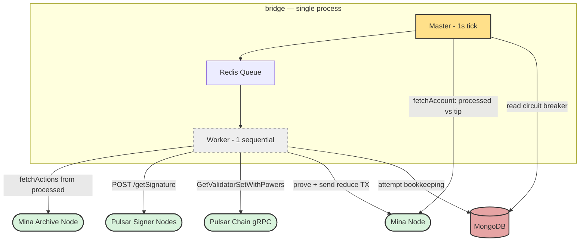
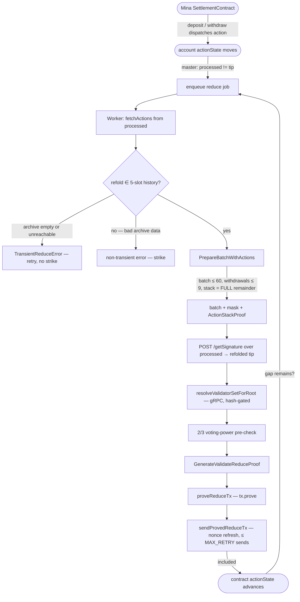
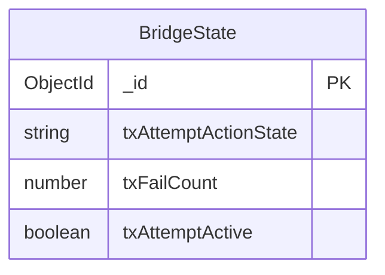
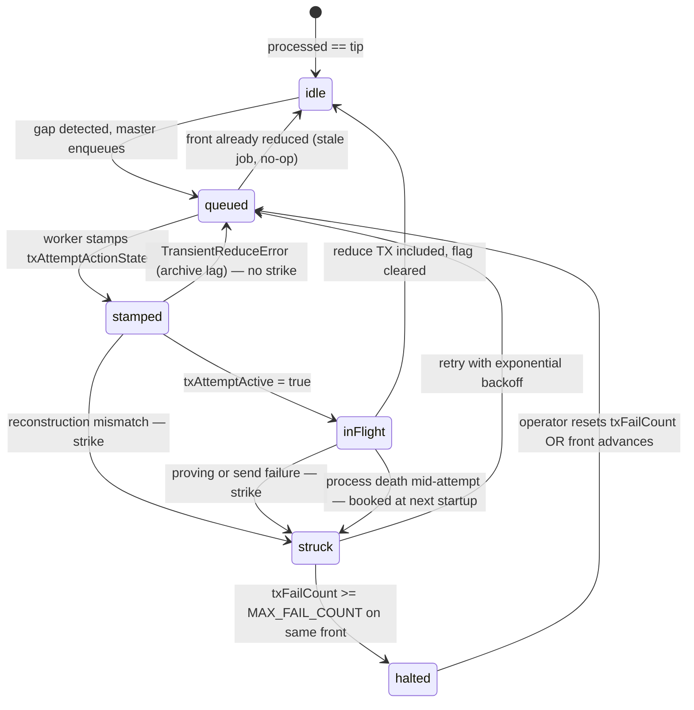

# Bridge Node

## Table of Contents

1. [Overview](#overview)
2. [System Architecture](#system-architecture)
3. [Modules](#modules)
    - [Database](#database)
    - [Mina](#mina)
    - [Pulsar](#pulsar)
    - [Bridge TX Sender](#bridge-tx-sender)
4. [End-to-End Flow](#end-to-end-flow)
5. [Data Models & ERD](#data-models--erd)
6. [State Machine](#state-machine)
7. [ZK Proof Pipeline](#zk-proof-pipeline)
8. [Failure Handling & Recovery](#failure-handling--recovery)
9. [Startup Sequence](#startup-sequence)
10. [Developer Notes](#developer-notes)

---

## Overview

`bridge` is the off-chain node that folds deposit and withdrawal actions dispatched to the Mina `SettlementContract` into the contract's state. It reads the contract's pending action queue directly from the chain, collects validator signatures, generates zero-knowledge proofs, and submits a `reduce()` transaction that advances the contract's processed pointer. It does not touch the settlement flow — that is the prover's job.

**The one design rule: the chain is the source of truth.** The pending work is the gap between two on-chain values read from the same `fetchAccount` snapshot:

| Value | Where | Meaning |
| --- | --- | --- |
| processed pointer | contract state slot 0 (`actionState`) | fold of every action the contract has **reduced** |
| queue tip | account `actionState[0]` (Mina stores 5) | fold of every action ever **dispatched** |

`processed == tip` → nothing to do. `processed != tip` → the difference IS the pending queue, fetched from the Archive with `fetchActions(contract, processed)` on every attempt. There is no work list in MongoDB, no per-block bookkeeping, and no finality delay before reducing: a reorged action makes the rebuilt fold disagree with the surviving branch, the contract rejects the TX, and the next attempt re-derives everything. Crash recovery is the same mechanism — whatever landed already moved `processed`.

**Key responsibilities:**

- Detecting pending actions from the contract's on-chain action-state gap
- Rebuilding the batch, mask and stack from the chain via the contracts package (`PrepareBatchWithActions`)
- Collecting validator signatures from Pulsar signer-nodes (HTTP REST)
- Resolving the ordered validator set (with powers) from the Pulsar chain (gRPC), hash-gated against the on-chain `merkleListRoot`
- Generating `ValidateReduceProof` and (if needed) `ActionStackProof` via `o1js`
- Submitting the `SettlementContract.reduce()` transaction to Mina
- Tracking ONLY attempt/failure bookkeeping in MongoDB (`BridgeState`, a singleton)
- Processing the queue front strictly in order with a single sequential BullMQ worker

---

## System Architecture


```mermaid
graph TD
    classDef db fill:#e6a4a4,stroke:#333,stroke-width:2px
    classDef processor fill:#ffe08a,stroke:#333,stroke-width:2px
    classDef worker fill:#eee,stroke:#999,stroke-dasharray: 5 5
    classDef external fill:#d8f3dc,stroke:#333,stroke-width:2px

    subgraph Bridge [bridge — single process]
        master[Master - 1s tick] --> queue[Redis Queue]
        queue --> worker1[Worker - 1 sequential]
    end

    Mina([Mina Node])
    Archive([Mina Archive Node])
    Signers([Pulsar Signer Nodes])
    Chain([Pulsar Chain gRPC])
    mongoDB[(MongoDB)]

    master -->|fetchAccount: processed vs tip| Mina
    master -->|read circuit breaker| mongoDB
    worker1 -->|fetchActions from processed| Archive
    worker1 -->|POST /getSignature| Signers
    worker1 -->|GetValidatorSetWithPowers| Chain
    worker1 -->|prove + send reduce TX| Mina
    worker1 -->|attempt bookkeeping| mongoDB

    class Mina,Archive,Signers,Chain external
    class mongoDB db
    class master processor
    class worker1 worker
```

**External service dependencies:**

| Service              | Purpose                                                       | Protocol        |
| -------------------- | ------------------------------------------------------------- | --------------- |
| Mina Node            | Read contract + account action states, submit `reduce()` TX   | o1js Mina RPC   |
| Mina Archive Node    | Fetch the pending action queue from the processed pointer     | GraphQL (HTTP)  |
| Pulsar Signer Nodes  | Collect validator signatures for each reduce                  | HTTP REST       |
| Pulsar Chain (gRPC)  | Ordered validator set with powers for `ValidateReduceProof`   | gRPC            |
| MongoDB              | Attempt/failure bookkeeping (`BridgeState` singleton)         | Mongoose ODM    |
| Redis                | BullMQ job queue backing store                                | ioredis         |

---

## Modules

### Database

**`src/db/`**

One MongoDB collection:

| Collection    | Purpose                                                                      |
| ------------- | ---------------------------------------------------------------------------- |
| `BridgeState` | Single document: which queue front is being attempted, how often it failed, and whether an attempt is in flight |

This is deliberately the ONLY persistent state: it is the operational memory the chain cannot hold for us. Everything else (pending actions, progress) is re-derived from the chain.

---

### Mina

**`src/services/mina/`**

**`client.ts`** — Initializes and holds the `MinaClientContext`. `refreshContractState` captures the contract's `zkappState` AND the account's five stored action states (`actionStateHistory`) from the same `fetchAccount` snapshot; getters expose the state slots by declaration order (0=actionState, 1=merkleListRoot, 2=stateRoot, 3=blockHeight — a PULSAR height, 4=actionListHash).

**`txSender.ts`** — Split into `proveReduceTx` (builds the `reduce()` transaction and runs the expensive `tx.prove()`, returning serialized TX JSON) and `sendProvedReduceTx` (retry loop of up to `MAX_RETRY` attempts: refresh nonce, re-sign the already-proved JSON, broadcast, wait for inclusion via `waitForTransaction`). The split means a nonce or broadcast failure never re-pays the proving cost.

---

### Pulsar

**`src/services/pulsar/`**

**`client.ts`** — Sends a `POST /getSignature` request to each configured Pulsar signer-node endpoint in parallel (`PULSAR_VALIDATOR_ENDPOINTS`). Collects responses, logs per-validator failures without aborting the whole batch, and returns a `ValidatorSignature[]` array containing the o1js `PublicKey` and `Signature` objects for each responding validator.

**`validatorSet.ts`** — Resolves the FULL ordered validator set (with powers) from the Pulsar chain over gRPC. Every candidate set is hash-gated: it is only returned if its leaf fold reproduces the contract's on-chain `merkleListRoot` (the leaf convention is single-sourced in `contracts/src/utils/validatorList.ts`). Verified sets are cached by root.

---

### Bridge TX Sender

**`src/workers/bridge-tx-sender/`**

Follows the same **Master / Worker pattern** used in the prover node:

```
┌─────────────────────────────────────────────┐
│         BridgeTxSenderMaster (1s tick)      │
│  - Skips if queue already has a job         │
│  - fetchAccount: processed vs queue tip     │
│  - Equal → sleep (nothing pending)          │
│  - Circuit breaker tripped → halt tick      │
│  - Backoff if the front has strikes         │
│  - Enqueues { fromActionState } to BullMQ   │
└────────────────────┬────────────────────────┘
                     │ add job
              ┌──────▼──────┐
              │ Redis Queue │  (BullMQ)
              └──────┬──────┘
                     │ consume job
┌────────────────────▼─────────────────────────┐
│            Worker — 1 sequential             │
│  - Re-derives processed/tip from the chain   │
│  - Stamps attempt identity in BridgeState    │
│  - fetchActions + reconstruction cross-check │
│  - Flags the attempt in-flight               │
│  - PrepareBatchWithActions (batch+mask+stack)│
│  - Collects validator signatures             │
│  - Generates ValidateReduceProof             │
│  - Proves + sends the reduce() TX            │
│  - Clears the in-flight flag                 │
└──────────────────────────────────────────────┘
```

One job = one reduce over the FRONT of the queue. The master re-queues while a gap remains, so a backlog drains `BATCH_SIZE` actions per job.

**Key timing constants:**

| Constant                   | Purpose                                                          |
| -------------------------- | ---------------------------------------------------------------- |
| `MASTER_SLEEP_INTERVAL_MS` | Master tick frequency when idle (1 s)                            |
| `WORKER_TIMEOUT_MS`        | BullMQ job lock duration (45 min — covers proving plus 3 inclusion waits); `maxStalledCount: 0` fails a stalled job instead of silently replaying it |
| `STALLED_INTERVAL_MS`      | BullMQ stall detection frequency (30 s)                          |
| `MAX_FAIL_COUNT`           | Non-transient strikes per queue front before the master halts (3)|
| `CACHE_DIR`                | o1js compile cache (`bridge/cache/`, shared SRS/Lagrange bases)  |

---

## End-to-End Flow


```mermaid
flowchart TD
    A([Mina SettlementContract]) -->|deposit / withdraw dispatches action| B([account actionState moves])

    B -->|master: processed != tip| C[enqueue reduce job]
    C --> D[Worker: fetchActions from processed]
    D --> E{refold ∈ 5-slot history?}
    E -->|archive empty or unreachable| Y[TransientReduceError — retry, no strike]
    E -->|no — bad archive data| X[non-transient error — strike]
    E -->|yes| F[PrepareBatchWithActions]

    F -->|batch ≤ 60, withdrawals ≤ 9, stack = FULL remainder| G[batch + mask + ActionStackProof]
    G --> H[POST /getSignature over processed → refolded tip]
    H --> I[resolveValidatorSetForRoot — gRPC, hash-gated]
    I --> J[2/3 voting-power pre-check]
    J --> K[GenerateValidateReduceProof]
    K --> L[proveReduceTx — tx.prove]
    L --> M[sendProvedReduceTx — nonce refresh, ≤ MAX_RETRY sends]
    M -->|included| N([contract actionState advances])
    N -->|gap remains?| C
```

---

## Data Models & ERD


```mermaid
erDiagram
    BridgeState {
        ObjectId _id PK
        string txAttemptActionState
        number txFailCount
        boolean txAttemptActive
    }
```

### Field notes

**BridgeState** — Single upserted document (created on first read if missing). `txAttemptActionState` is the queue front (contract `actionState`) of the last attempt — the identity failures are charged to. `txFailCount` counts consecutive NON-transient failures against that same front and resets when the front advances. `txAttemptActive` is true while proving/sending is in flight; still true at boot means the previous attempt died mid-flight and is booked as a failure (deliberate restarts included — accepted, since the counter resets when the front advances).

---

## State Machine

### Reduce attempt lifecycle (per queue front)


```mermaid
stateDiagram-v2
    [*] --> idle : processed == tip
    idle --> queued : gap detected, master enqueues

    queued --> idle : front already reduced (stale job, no-op)
    queued --> stamped : worker stamps txAttemptActionState

    stamped --> queued : TransientReduceError (archive lag) — no strike
    stamped --> struck : reconstruction mismatch — strike
    stamped --> inFlight : txAttemptActive = true

    inFlight --> idle : reduce TX included, flag cleared
    inFlight --> struck : proving or send failure — strike
    inFlight --> struck : process death mid-attempt — booked at next startup

    struck --> queued : retry with exponential backoff
    struck --> halted : txFailCount >= MAX_FAIL_COUNT on same front

    halted --> queued : operator resets txFailCount OR front advances
```

---

## ZK Proof Pipeline

The worker generates two proofs before submitting the reduce transaction. Both are built from inputs produced by `PrepareBatchWithActions` in the contracts package — the bridge does not reimplement any circuit arithmetic.

### ValidateReduceProof

Proves that a quorum of validators has signed the `(merkleListRoot, actionListHash)` pair. The `actionListHash` is computed by `CalculateMax` (in `contracts/src/utils/reduceWitness.ts`) with the same loop `SettlementContract.reduce()` runs on-circuit: it folds only the batch entries that are real (non-dummy) AND approved by the mask, in order, starting from the contract's current on-chain `actionListHash`.

The signature list always carries the FULL ordered validator set: non-signers get the well-formed dummy signature `(r=1, s=1)`, which fails `signature.verify` in-circuit (contributing no voting power) while keeping the leaf fold equal to `merkleListRoot`. A 2/3 voting-power pre-check runs off-circuit first so an impossible quorum fails fast instead of after minutes of proving.

### ActionStackProof

Proves the fold of the ENTIRE pending remainder beyond the batch, so the contract's `account.actionState` precondition can target the true queue tip. `ActionStackProgram.proveBase` handles the first `ACTION_QUEUE_SIZE` chunk; `proveRecursive` is called once per additional chunk. Every recursion layer re-exposes the ORIGINAL anchor (the batch-end action state) as `publicInput` and resumes folding from the previous layer's output — the contract asserts `publicInput == actionState` (the batch-end fold) and `account.actionState == publicOutput` (the queue tip, matched against Mina's 5 stored states).

When the remainder is empty, `useActionStack = false` and a shape-correct dummy (`ActionStackProof.dummy(Field(0), Field(0), 1, 14)`) is passed instead of a real proof — the contract runs it through `verifyIf(false)`, which still requires the correct proof shape but not a real execution.

---

## Failure Handling & Recovery

### Failure identity

Failures are charged to the queue front (`txAttemptActionState`), not to a job: the worker stamps the identity BEFORE fetching, so even pre-proving failures land on the right front. A front that advances resets the counter — progress forgives.

### Transient vs strike

| Failure | Class | Effect |
| --- | --- | --- |
| Archive unreachable or returns nothing on a gap | `TransientReduceError` | logged, retried, never counted |
| Reconstruction mismatch (refold ∉ 5-slot history) | strike | deterministic bad archive data |
| Signature / proving / send failure | strike | attributed via the stamped identity |
| Process death mid-attempt (crash, OOM, or a deliberate restart) | strike | booked at next startup via `txAttemptActive`; deliberate restarts costing a strike is accepted — the counter resets when the front advances |

### Backoff and halt

The master backs off exponentially (`1s · 2^strikes`, capped at 60 s) before re-queueing a front that already has strikes, so `MAX_FAIL_COUNT` cannot be consumed within seconds by one bad stretch. At `txFailCount >= MAX_FAIL_COUNT` for the CURRENT front the master halts: 60 s idle per tick with an error log each time. The condition is re-evaluated every tick, so clearing `txFailCount` in Mongo — or the front advancing (e.g. another bridge instance reduced it) — recovers automatically. Skipping is impossible by construction: each reduce chains the contract's `actionState`.

### TX send retries

`sendProvedReduceTx` has its own inner retry loop (up to `MAX_RETRY` attempts, separate from job retries). On each attempt it refreshes the sender nonce from the chain, re-signs the already-proved transaction, and retries the broadcast. This handles transient node failures or nonce staleness without re-running the expensive `tx.prove()` step.

---

## Startup Sequence

On start, `main()` in `index.ts`:

1. Connects to MongoDB
2. Runs `masterRunner()` → `BridgeTxSenderMaster.onStartup()`:
   - Initializes the `MinaClientContext` (fetches the contract account, sets up the o1js network)
   - Books an interrupted attempt as a failure if `txAttemptActive` is still true (the obliterate below destroys BullMQ's own deferred-failure evidence)
   - Obliterates the BullMQ queue (clears stale jobs)
   - Compiles all four circuits via `ensureCompiled()` with `Cache.FileSystem(CACHE_DIR)` — BEFORE any job can run, so compilation never burns a job's lock window
3. Creates the single BullMQ worker and enters the master tick loop

The worker lazily initializes its own `MinaClientContext` on first job.

---

## Developer Notes

### Sequential worker is mandatory

`SettlementContract.reduce()` advances the contract's `actionState`. If two reduce transactions were sent in parallel, the second would fail because the contract's action state would have already been updated by the first. The single sequential worker is not a performance trade-off — it is a correctness requirement.

The master enforces this by checking `bridgeTxSenderQ.getJobCounts()` before enqueuing. If there is already a waiting or active job, the master sleeps and exits the current tick.

### Witness construction is single-sourced in contracts

The bridge deliberately owns NO circuit arithmetic. Batch, mask, `actionListHash` and the stack proof all come from `PrepareBatchWithActions` in `contracts/src/utils/reduceWitness.ts` — the same file family the circuits are written against, including the per-batch caps (`MAX_WITHDRAWAL_PER_BATCH = 9`, because the contract pays each masked withdrawal as an AccountUpdate). Do not reimplement any of it here: a hand-maintained mirror WILL drift, and the drift only surfaces as an opaque on-chain rejection after minutes of proving.

### The chain is re-read on every attempt

Nothing about a previous attempt is trusted: each job re-reads `processed`, refetches the queue, and refolds it. The refold must land inside the account's 5-entry action-state history before any proving starts — this catches wrong ordering, missing actions and failed-command rows from the Archive up front. The same 5-slot window is what tolerates actions dispatched while a proof is being generated.

### The includedActions map is a placeholder

`PrepareBatchWithActions` masks actions from an approval map. The bridge currently approves everything, which is safe for deposits (funds already escrowed on L1) but NOT a final answer for withdrawals — the real approval set must come from the validators once the `/getSignature` spec covers it.

### Nonce refresh between prove and send

The zkApp proof commits to the account-update forest, not the fee-payer body, so `sendProvedReduceTx` can rewrite the nonce and re-sign without invalidating the proof. This is why proving and sending are split.

### Validator endpoints are configured at runtime

`PULSAR_VALIDATOR_ENDPOINTS` is read per call, not cached at module load — signer nodes can be rotated without a rebuild.

### contracts/build/src imports

Value imports come from `pulsar-contracts/build/src/...` deep paths (the compiled artifacts the circuits actually run as). Two deliberate exceptions: `validatorSet.ts` imports `computeValidatorListHash` from the package root to single-source the validator leaf convention, and `ensureCompiled()` imports `SettlementProof.js`/`SettlementContract.js` dynamically — declaring the contract executes its `@method` decorators against the proof classes, which unit tests replace with mocks.
