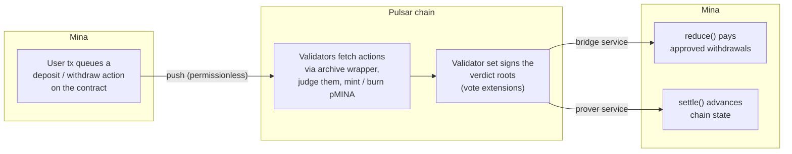
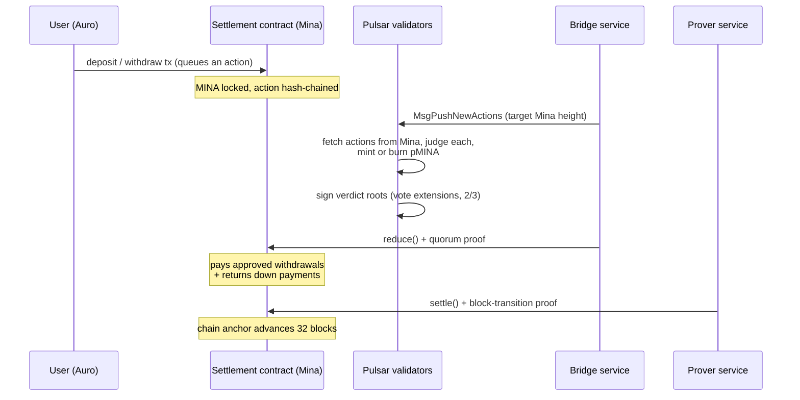

# How It Works

Pulsar bridges MINA to pMINA by combining two chains. A zkApp on Mina holds
the funds and enforces the rules, while a Cosmos SDK appchain decides what
should happen. This page covers both: the pieces, and the path one transfer
takes through them.

## Why an appchain, and why not an L2

Pulsar is **not a ZK rollup**. Individual Pulsar transactions are never
proven to Mina; they finalize at Tendermint speed, with no proving cost per
transaction. What reaches Mina is the *outcome*: the validator set signs
what happened, and a recursive proof of those signatures is what the
settlement contract verifies. Day to day you trust Pulsar's consensus, the
same way you trust any proof-of-stake chain; the Mina contract holds the
locked funds and releases them only against that proof.

This split is the point of the design. A consensus chain gives the
application layer high throughput without ZK circuit limits, while Mina
anchors the long-term security of the funds in a succinct proof. Being a
Cosmos SDK chain also leaves the door open to IBC, connecting pMINA to the
wider Cosmos ecosystem in the future.

## The pieces

- **The settlement contract**, a zkApp on Mina. It holds the locked MINA,
  queues every deposit and withdrawal as an action, and pays out only against
  a proof that Pulsar's validators approved the payment.
- **The Pulsar chain**, a Cosmos SDK appchain. Its validators read the
  contract's actions from Mina, judge each one, mint or burn pMINA, and sign
  the results. Each validator reads Mina through its own sidecar, so no
  validator depends on anyone else's view of the source chain.
- **Two off-chain services.** The **bridge** keeps the chain scanning Mina
  and submits the transactions that pay approved withdrawals; the **prover**
  proves Pulsar's block history back to the contract. Neither holds any
  privilege: they pay fees and carry proofs.

Two properties do the heavy lifting:

- **Actions are hash-chained on both sides.** The contract's action state
  commits to every action in order, and the chain rebuilds the same sequence
  into its own accumulator, verdicts included. Neither side can skip,
  reorder, or invent an action unnoticed.
- **Verdicts are proven, not trusted.** The contract does not believe any
  off-chain service. It verifies a recursive proof that at least two thirds
  of the validator set signed the verdicts being applied.

## One transfer, end to end

### 1. An action is queued on Mina

A deposit or withdrawal is a Mina transaction against the settlement
contract. It moves the MINA, either a deposit's amount or a withdrawal's
1 MINA down payment, and dispatches an **action** carrying account, amount,
and type into the contract's action queue. Mina's action mechanism
hash-chains these into the contract's `actionState`, so the queue's order and
contents are committed on-chain from the moment of dispatch.

### 2. Pulsar adjudicates it

Anyone can submit `MsgPushNewActions` to the chain. It carries nothing but a
target Mina height, so there is nothing to trust the sender about. On
receiving it, **every validator's node fetches the actions itself** from its
own archive wrapper, a sidecar serving finalized Mina data, and judges each
one:

- a **deposit** is valid if the sending Mina key is registered, and then
  pMINA is minted to the registered account;
- a **withdrawal** is valid if the key is registered *and* the account's
  spendable pMINA covers the amount, and then the pMINA is burned;
- anything else is invalid, and nothing moves.

Valid or not, **every action becomes a leaf**, a hash of the action plus its
verdict bit, appended to the chain's actions accumulator. An invalid action
is committed as rejected rather than skipped, which is what lets Mina later
distinguish "denied" from "never seen".

### 3. Validators sign what they did

Each validator holds a Mina-compatible signing key, registered on-chain
alongside its consensus key. Through CometBFT **vote extensions**, every
block's validators sign a digest that includes the current actions
accumulator root and the validator set. The chain persists these signatures
and requires two thirds of voting power for them to count, so a signed root
is a statement by the validator set itself, verifiable with nothing but
Mina-style signature checks.

### 4. `reduce()` pays withdrawals

The bridge service watches the contract's queue. When actions are pending, it
builds a batch of up to 30 actions, walks the chain's verdict leaves from the
contract's `approvalCursor`, and generates a recursive proof. The contract
accepts the batch only if the proof shows, among other things:

- the verdict leaves fold from the contract's own cursor to a root **signed
  by at least two thirds of the validator set**, and that validator set
  hashes to the root pinned in the contract's state, so a prover cannot
  invent one;
- the batch is a true prefix of the contract's real action queue;
- a commitment binding batch, verdicts, and both cursors matches what the
  circuit verified, so the verdicts paid out are exactly the ones signed.

For each approved withdrawal in the batch the contract pays **amount + down
payment** to the action's account. Denied withdrawals keep their down
payment. Deposits need no payment here, because their effect was the mint on
Pulsar and the leaf only records the verdict.

### 5. `settle()` advances the anchor

Independently, the prover service proves Pulsar's own block transitions:
vote-extension signatures for each block, folded 8 blocks at a time and
aggregated to 32. A `settle()` transaction carries that proof and advances
the contract's stored chain state root and block height by exactly 32 blocks.
This is the contract's anchor into Pulsar, the state that future proofs are
checked against.

The anchor does more than bridge bookkeeping: it makes Pulsar itself
**succinctly verifiable**. Every checkpoint is a proven consequence of the
one before it, all the way back to genesis, so verifying Pulsar's history
never means replaying the chain. Trust the contract's latest checkpoint on
Mina and follow at most the ~32 blocks since, a constant amount of work no
matter how long the chain grows.

## Trust model

**Fund safety** rests on the contract's checks alone:

- Withdrawals pay only with a verified two-thirds quorum proof over the
  pinned validator set.
- The batch must extend the contract's own action state and cursor, so
  replay, reorder, and skip are all structurally impossible. An approved
  action must be paid, and an omitted one simply stays queued.
- The contract's verification key is frozen at deployment, and its anchors
  are set in `deploy()` itself, so there is no post-deploy initialization to
  race.

**Liveness** rests on the off-chain services. The push is permissionless, and
the bridge and prover hold no special rights: they are fee payers. If every
one of them vanished, transfers would stall until someone ran them again. No
state they hold is needed to resume, because every attempt re-reads the
contract and the chain from scratch.

The real trust boundary is the **validator set**. Two thirds of its voting
power can, by construction, approve anything. That is the same assumption the
chain itself makes, so the bridge adds no new party to trust.
