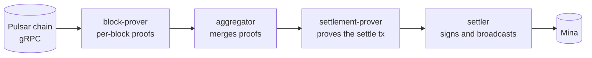

# Running the Prover

The prover turns Pulsar's block history into `settle()` transactions on Mina.
It runs as **five processes** (a coordinator plus four workers) over Redis
and MongoDB:



## Prerequisites

- Node ≥ 20, pnpm
- **MongoDB** and **Redis**
- A **Pulsar gRPC** endpoint and a funded **Mina** fee-payer account
- ~8 GB memory **per proving process**, and ~2–3 GB disk for the compile
  cache (`prover/cache/`, safe to delete but slow to rebuild)

## Setup, in this order

```bash
pnpm install                 # repo root
cd prover
cp .env.example .env         # fill in, see below
pnpm run seed                # ONCE, with the chain reachable
pnpm run deploy              # only for a fresh contract deployment
pm2 start ecosystem.config.cjs   # or: pnpm run start
```

- `seed` writes the genesis and anchor blocks the pipeline builds from. Run
  it once, before first start. It is idempotent.
- `deploy` compiles everything (several minutes) and anchors a **new**
  contract. It refuses to run unless its address matches the chain's
  configured contract, and the deploy keypair is single-use because the
  verification key is sealed at deployment. If you are joining an existing
  deployment, skip it and just set `CONTRACT_ADDRESS`.

## Environment

| Variable | Meaning |
| --- | --- |
| `MONGO_URI`, `REDIS_HOST`/`REDIS_PORT` | State and queues |
| `PULSAR_GRPC_ENDPOINT` | The chain (`:443` gets TLS automatically) |
| `CONTRACT_ADDRESS` | The settlement contract |
| `MINA_PRIVATE_KEY` | Fee payer for settle transactions |
| `MINA_NETWORK` | `devnet`, `mainnet`, or `lightnet` |
| `SETTLER_WINDOW` | In-flight settle txs (default 5; keep well under Mina's ~10 per-account mempool cap) |
| `EPOCH_START_HEIGHT` | Frozen at seed time; changing it means `pnpm run reset` plus a redeploy |

## Health

```bash
pnpm run doctor    # one-shot verdict: what is blocking, or "throughput, not a wedge"
pnpm run gap       # contract height vs chain tip; -- --watch 30 to follow
```

Doctor checks heights, fee-payer balance, the pipeline's state distribution,
the exact epoch the contract needs next, in-flight settle transactions, and
the known failure classes, with copy-pasteable recovery commands where one
exists.

## Scaling

- **Scale freely:** `pulsar-block-prover`, `pulsar-aggregator`,
  `pulsar-settlement-prover` (`pm2 scale …`). Stale-claim sweeping is
  age-gated precisely so sibling instances don't steal each other's live
  work.
- **Never scale `pulsar-settler`.** Mina transactions are nonce-based and
  settle transactions chain by state precondition, so they must be signed
  and broadcast in strict height order by a single sequential worker. Two
  settlers would reuse nonces and evict each other's pending transactions.
  Settler throughput comes from pipelining (`SETTLER_WINDOW`), not
  parallelism.

## Crash recovery

Automatic. Proofs are durable in MongoDB; a stalled settle transaction is
detected by timeout and re-sent (not re-proven); interrupted work is swept
back to the queue after its age gate. pm2 restarts complete the picture.
