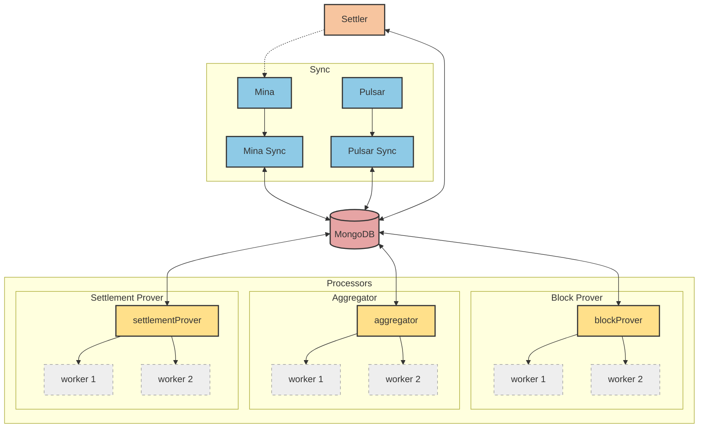
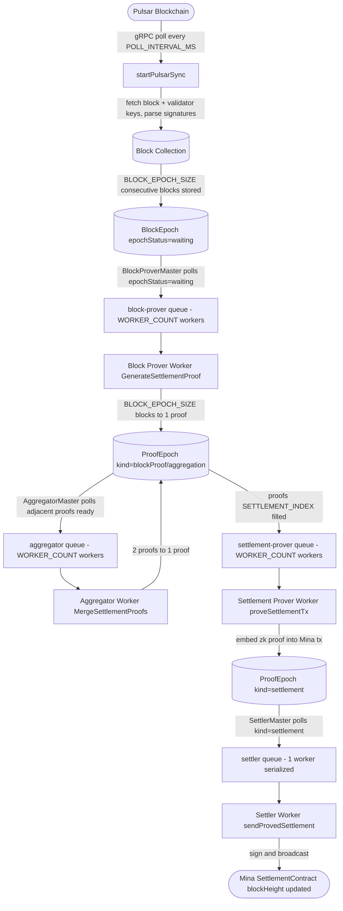
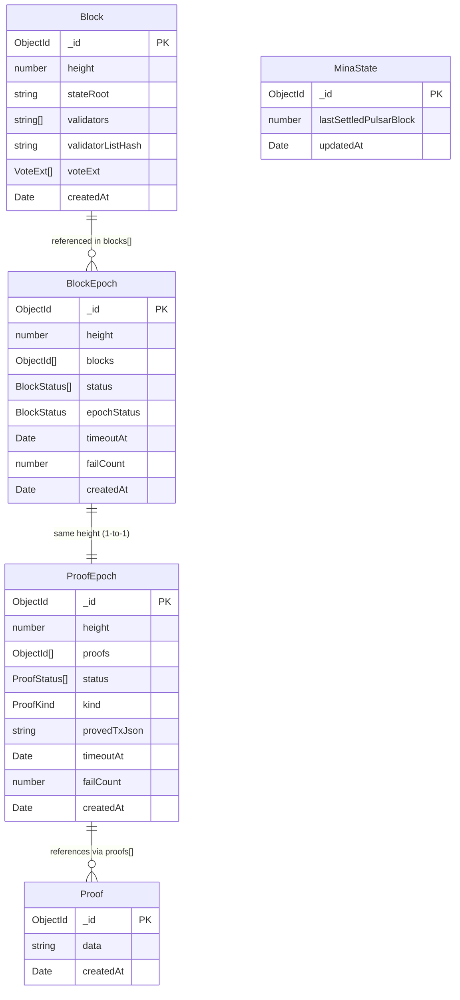
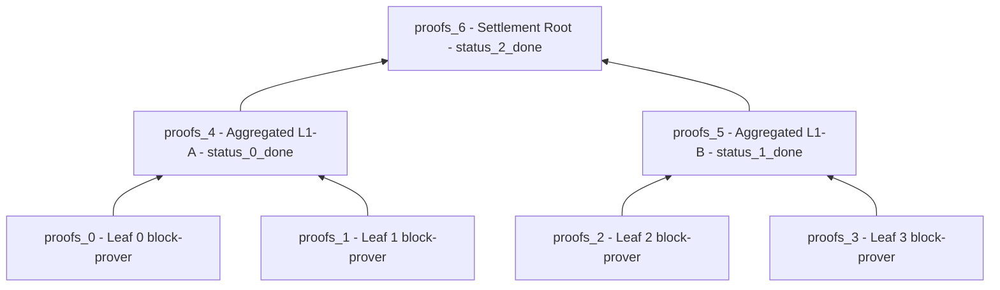
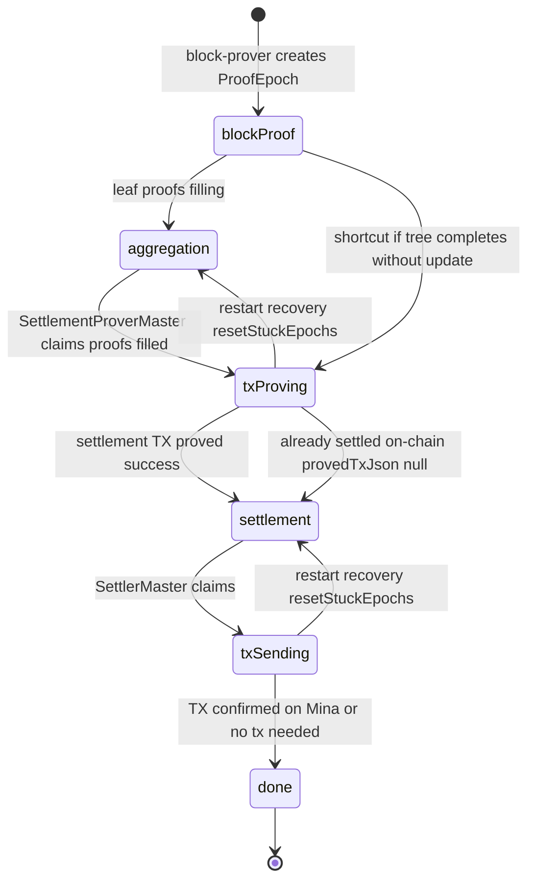
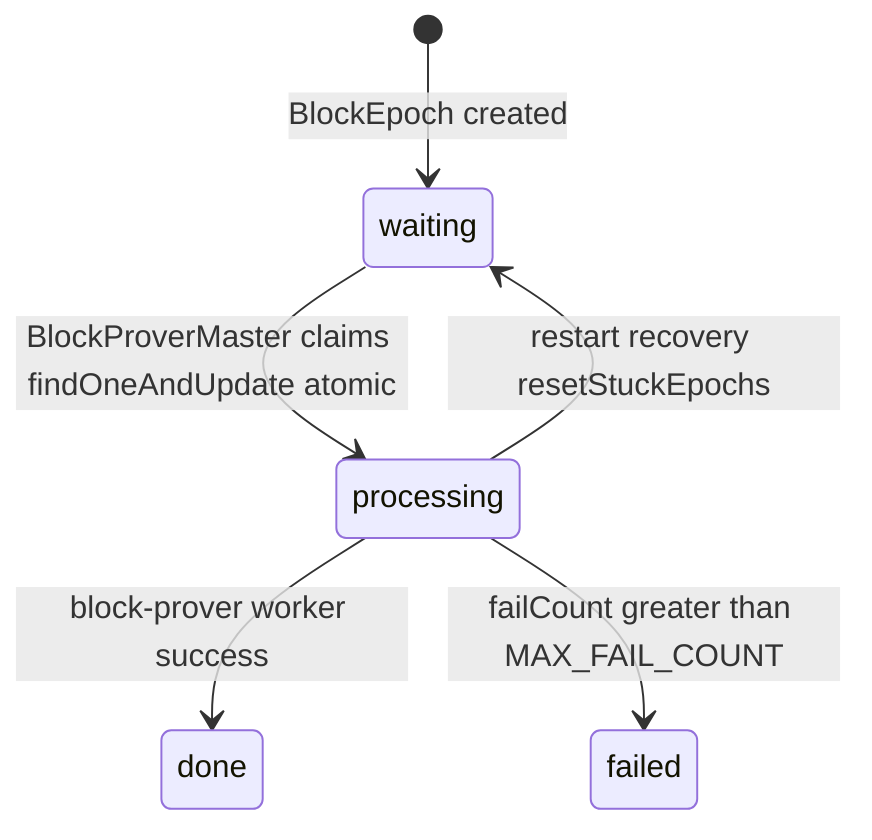
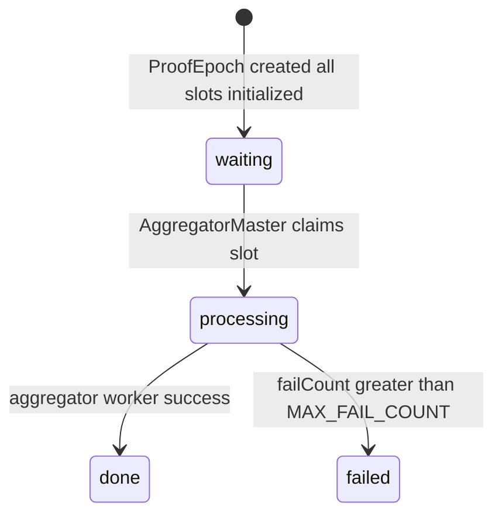

# Prover Node

## Table of Contents

1. [Overview](#overview)
2. [System Architecture](#system-architecture)
3. [Modules](#modules)
    - [Database](#database)
    - [Pulsar](#pulsar)
    - [Processors](#processors)
    - [Mina](#mina)
4. [Processor Pipeline](#processor-pipeline)
5. [Data Models & ERD](#data-models--erd)
6. [Proof Aggregation Tree](#proof-aggregation-tree)
7. [State Machines](#state-machines)
8. [Failure Handling & Recovery](#failure-handling--recovery)
9. [Startup Sequence](#startup-sequence)
10. [Developer Notes](#developer-notes)

---

## Overview

`prover_v2` is the off-chain proving service that bridges the Pulsar blockchain and the Mina blockchain. It continuously reads blocks from Pulsar, generates zero-knowledge proofs over batches of blocks, aggregates those proofs into a single settlement proof, and submits the proven settlement transaction to the Mina `SettlementContract`.

**Key responsibilities:**

- Syncing block and validator data from Pulsar via gRPC
- Generating zk proofs over groups of `BLOCK_EPOCH_SIZE` Pulsar blocks (`pulsar-contracts` / `o1js`)
- Aggregating leaf proofs into a binary tree to produce a single root proof
- Proving and sending the Mina settlement transaction
- Tracking all progress and failure state in MongoDB
- Distributing heavy proving work across a BullMQ worker pool backed by Redis

---

## System Architecture



**External service dependencies:**

| Service          | Purpose                                         | Protocol         |
| ---------------- | ----------------------------------------------- | ---------------- |
| Pulsar gRPC node | Block data, validator keys, vote extensions     | gRPC             |
| MongoDB          | Persistent state for all epochs, proofs, blocks | Mongoose ODM     |
| Redis            | BullMQ job queue backing store                  | ioredis          |
| Mina RPC         | SettlementContract interaction, TX broadcasting | o1js Mina client |

---

## Modules

### Database

**`src/modules/db/`**

Five MongoDB collections, all managed with Mongoose:

| Collection   | Purpose                                                                           |
| ------------ | --------------------------------------------------------------------------------- |
| `Block`      | Raw Pulsar block data (state root, validators, signatures)                        |
| `BlockEpoch` | Groups `BLOCK_EPOCH_SIZE` Block references; tracks per-block processing status    |
| `ProofEpoch` | Binary proof tree for one epoch; tracks aggregation progress and settlement state |
| `Proof`      | Serialized zk proof JSON blobs (referenced by `ProofEpoch.proofs[]`)              |
| `MinaState`  | Latest `lastSettledPulsarBlock` as read from the Mina contract                    |

---

### Pulsar

**`src/modules/pulsar/`**

Polls the Pulsar node every `POLL_INTERVAL_MS` via gRPC, fetches new blocks one by one, and persists them to MongoDB. For each block it retrieves the state root, the validator set with their Mina public keys, and the vote extensions (validator signatures). It also computes a Poseidon hash over the validator list, which is used as a circuit input later. Once a block is stored, it is automatically placed into its `BlockEpoch` slot.

Every `BLOCK_EPOCH_SIZE` consecutive blocks are grouped into a `BlockEpoch`. The epoch's identifying height is always the first block's height rounded down to the nearest multiple of `BLOCK_EPOCH_SIZE`.

---

### Mina

**`src/modules/mina/`**

Handles all interaction with the Mina blockchain. The client module initializes a connection to the target network and provides a handle to the deployed `SettlementContract`. Both the settlement-prover and settler cache this client as a lazy singleton per process. The settlement module contains the two main operations: proving a settlement transaction (expensive, done once) and sending an already-proved transaction (cheap, done on demand). The sync module runs a background poll loop that tracks the contract's current `blockHeight` and persists it to `MinaState` so other parts of the system can reference it without hitting the RPC each time.

---

### Processors

**`src/modules/processors/`**

All processors share the same **Master / Worker pattern**:

```
┌─────────────────────────────────────────────┐
│             Master (per processor)          │
│  - Polls MongoDB for available work         │
│  - Atomically claims work ($set status)     │
│  - Enqueues jobs to BullMQ queue            │
│  - Releases claim if enqueue fails          │
│  - Handles worker failures via callback     │
└────────────────────┬────────────────────────┘
                     │ add job
              ┌──────▼──────┐
              │ Redis Queue │  (BullMQ)
              └──────┬──────┘
                     │ consume job
┌────────────────────▼─────────────────────────┐
│           Worker pool (N workers)            │
│  - One job at a time per worker              │
│  - Lock duration: WORKER_TIMEOUT_MS          │
│  - Stall check interval: STALLED_INTERVAL_MS │
└──────────────────────────────────────────────┘
```

**Key timing constants:**

| Constant                   | Purpose                                                                                                                            |
| -------------------------- | ---------------------------------------------------------------------------------------------------------------------------------- |
| `MASTER_SLEEP_INTERVAL_MS` | Master poll frequency when idle                                                                                                    |
| `WORKER_TIMEOUT_MS`        | BullMQ job lock duration; also used as `timeoutAt` extension on failure                                                            |
| `STALLED_INTERVAL_MS`      | BullMQ stall detection frequency                                                                                                   |
| `WORKER_COUNT`             | Default worker pool size (settler overrides to 1, see [Settler Uses 1 Worker Intentionally](#settler-uses-1-worker-intentionally)) |

#### Block Prover

**Queue:** `block-prover` | **Workers:** `WORKER_COUNT`

Picks up a completed `BlockEpoch` and generates a single zk `SettlementProof` from all `BLOCK_EPOCH_SIZE` blocks. This is the most computationally expensive step in the pipeline. The resulting proof is stored in a new `ProofEpoch` as a leaf node, making the epoch eligible for aggregation. On retry, if a proof was already stored from a previous attempt, proof generation is skipped.

#### Aggregator

**Queue:** `aggregator` | **Workers:** `WORKER_COUNT`

Merges pairs of proofs within a `ProofEpoch` up the binary tree until the single root proof is produced. The master detects all mergeable pairs simultaneously and enqueues them in parallel, so multiple aggregation jobs for the same epoch can run concurrently. On retry, already-completed aggregation slots are skipped.

#### Settlement Prover

**Queue:** `settlement-prover` | **Workers:** `WORKER_COUNT`

Takes the root proof from a completed `ProofEpoch` and wraps it into a Mina settlement transaction by calling `tx.prove()`. The resulting pre-proved transaction JSON is stored on the epoch. Before doing any work, it checks whether the epoch is already settled on-chain — if so, it stores `null` instead of a transaction and moves on (the settler handles this gracefully). See [Max Settle Check](#max-settle-check).

#### Settler

**Queue:** `settler` | **Workers:** 1 (serialized — only one Mina TX in flight at a time)

Reconstructs the pre-proved transaction, signs it, and broadcasts it to Mina. It does **not** re-run `tx.prove()` — the proof is already embedded in the stored JSON. It waits for on-chain inclusion and retries up to `MAX_RETRY_COUNT` times on failure. If the stored transaction is `null` (epoch was already settled during proving), it marks the epoch done without sending anything. The single-worker constraint prevents nonce conflicts on the Mina account. See [Max Settle Check](#max-settle-check).

---

## Processor Pipeline



---

## Data Models & ERD



### Field notes

**Block** — TTL: keeps last `BLOCKS_TO_KEEP` blocks. `validatorListHash` is a Poseidon hash of the validator set, used directly as a zk circuit input. `voteExt` carries the per-validator Mina signatures for that block.

**BlockEpoch** — `height` is always a multiple of `BLOCK_EPOCH_SIZE` (the first block in the group). `epochStatus` tracks the overall lifecycle; `status[]` tracks individual block slots. `timeoutAt` is refreshed on each failure and used by masters as a staleness filter. TTL: `PROOF_TTL_SECONDS`.

**ProofEpoch** — `height` matches its `BlockEpoch`. `proofs[]` holds both leaf and aggregated proof references; `status[]` tracks each aggregation job. `kind` is the main lifecycle indicator (see [State Machines](#state-machines)). `provedTxJson` is the serialized pre-proved Mina transaction — `null` signals the epoch was already settled on-chain during proving. TTL: `PROOF_TTL_SECONDS`.

**Proof** — Stores a single serialized `SettlementProof` JSON blob. Referenced by `ProofEpoch.proofs[]`. TTL: `PROOF_TTL_SECONDS`.

**MinaState** — Single upserted document. Tracks the last Pulsar block height that has been confirmed as settled on the Mina contract.

---

## Proof Aggregation Tree

Each `ProofEpoch` contains a complete binary proof tree. The number of leaves is controlled by `PROOF_EPOCH_LEAF_COUNT`.

`proofs[]` holds every node in the tree — both the `PROOF_EPOCH_LEAF_COUNT` leaf proofs (produced by the block-prover) and the `PROOF_EPOCH_LEAF_COUNT - 1` aggregated proofs (produced by the aggregator). Total size: `PROOF_EPOCH_LEAF_COUNT * 2 - 1`.

`status[]` only tracks the **aggregated nodes** — it has `PROOF_EPOCH_LEAF_COUNT - 1` entries, one per aggregation job. Leaf slots have no corresponding status entry because the block-prover fills them directly without going through the aggregator's claim mechanism.

The diagram below shows the tree for the current value of `PROOF_EPOCH_LEAF_COUNT`:



**Index formula:**

- Leaf proofs: `proofs[0]` to `proofs[PROOF_EPOCH_LEAF_COUNT - 1]`
- Aggregated proofs: `proofs[PROOF_EPOCH_LEAF_COUNT + aggregation.index]`
- Settlement root: `proofs[PROOF_EPOCH_SETTLEMENT_INDEX]` = `proofs[PROOF_EPOCH_LEAF_COUNT * 2 - 2]`

**Aggregation patterns** (defined in `aggregator/master.ts`):

| Pattern | startNode | aggregated | Merges                | Stores result at                |
| ------- | --------- | ---------- | --------------------- | ------------------------------- |
| 0       | 0         | 0          | proofs[0] + proofs[1] | proofs[4]                       |
| 1       | 2         | 1          | proofs[2] + proofs[3] | proofs[5]                       |
| 2       | 4         | 2          | proofs[4] + proofs[5] | proofs[6] = **settlement root** |

> **Note:** The patterns array in `aggregator/master.ts` defines 15 entries, supporting trees up to 16 leaves. Only the patterns whose `proofs[startNode]` and `proofs[startNode + 1]` slots exist will ever match — the rest evaluate to `false` in the MongoDB query automatically. This means scaling the tree requires changing only `PROOF_EPOCH_LEAF_COUNT`; the aggregator adapts without any other code change.

---

## State Machines

### ProofKind (ProofEpoch lifecycle)



### BlockStatus (BlockEpoch.epochStatus)



### ProofStatus (ProofEpoch.status[n] — per aggregation slot)



---

## Failure Handling & Recovery

### Failure counters

Every worker failure increments the epoch's `failCount` and extends its `timeoutAt` by `WORKER_TIMEOUT_MS`, giving it a cooldown window before the master picks it up again.

### Max Fail Count

On startup, any epoch whose `failCount` has exceeded `MAX_FAIL_COUNT` is permanently marked `failed` and excluded from all future master queries.

### Restart safety

On every startup, before any processor is started, stuck epoch states are reset:

| Stuck state                           | Cause                       | Reset to      |
| ------------------------------------- | --------------------------- | ------------- |
| `BlockEpoch.epochStatus = processing` | Crashed block-prover worker | `waiting`     |
| `BlockEpoch.status[n] = processing`   | Crashed per-block worker    | `waiting`     |
| `ProofEpoch.kind = txProving`         | Crashed settlement-prover   | `aggregation` |
| `ProofEpoch.kind = txSending`         | Crashed settler             | `settlement`  |

### Max Settle Check

Both the settlement-prover and the settler query the Mina contract's current `blockHeight` before doing any work. If the contract has already recorded a height that covers this epoch, the operation is skipped entirely. This prevents duplicate transactions and wasted proof computation in case of concurrent workers or a mid-job restart.

The check is intentionally done at **two points**: once before proving (expensive) and once before sending (cheaper but still important for correctness).

### Duplicate proof prevention on retry

The block-prover checks whether the `ProofEpoch` already has proofs before regenerating. The aggregator checks whether an aggregation slot is already marked `done`. Both skip silently if the work was already completed in a previous attempt.

---

## Startup Sequence

On start, the application:

1. Connects to MongoDB
2. Obliterates all BullMQ queues to clear any leftover jobs from a previous run
3. Resets stuck epoch states so crashed workers don't permanently lock an epoch
4. Marks any epochs that exceeded `MAX_FAIL_COUNT` as permanently failed

After these steps, processors and sync loops are started separately.

> **Note:** Database seeding (genesis blocks at heights 0 and 1, and the initial `BlockEpoch`) is **not** done automatically on startup. It must be run once before the first start via `npm run seed`. See the [README](../README.md) for details.

---

## Developer Notes

### Max Settle Check — why it exists

The settlement-prover runs with `WORKER_COUNT` concurrent workers. Without the on-chain check, multiple workers could race to prove and send a transaction for the same epoch, resulting in a wasted `tx.prove()` call (which can take several minutes) and a rejected duplicate transaction on Mina. The check is done at both the proving step and the sending step because they are two separate race windows.

### Settler uses 1 worker intentionally

Mina transactions are nonce-based and sequential. Running two settlement sends in parallel would cause a nonce conflict and a failed transaction. One serialized worker is the correct design.

### Settler queue size is capped at 1 — approach is architecture-dependent

`SettlerMaster.handleTask()` checks `settlerQ.getJobCounts()` before claiming an epoch. If the queue already has a waiting or active job, the master sleeps and returns. It effectively blocks the producer loop until the worker finishes.

**Why this works here:** There is exactly one settler master instance and it runs a sequential `while(true)` loop. The `getJobCounts → add` window has no meaningful race risk in this setup.

**Why this would break with multiple pushers:** If multiple masters or services could push to the settler queue concurrently, the poll-then-add pattern would not be race-safe; e.g. two callers could both see `queueSize = 0` and both enqueue. In that scenario, an atomic primitive (Redis script, BullMQ Pro `maxSize`, or a distributed lock) would be required instead.

Do not remove or relax this check without revisiting the assumption that a single sequential master is the only producer.

### Aggregation tree depth is configurable

`PROOF_EPOCH_LEAF_COUNT` in `constants.ts` controls the entire tree shape — the size of `proofs[]`, the size of `status[]`, and the settlement root index all derive from it. The aggregator's 15 hardcoded patterns support up to `PROOF_EPOCH_LEAF_COUNT = 16` without any code changes. Increasing this constant is the only thing required to scale the tree depth.

### timeoutAt is not a hard deadline

`timeoutAt` acts as a **staleness filter and cooldown**, not a hard expiry. Masters skip epochs where `timeoutAt` is in the past, which gives recently-failed epochs a `WORKER_TIMEOUT_MS` cooldown before they are retried. Each failure resets the window, preventing a broken epoch from being processed continuously.

### provedTxJson = null semantics

When the settlement-prover finds the epoch already settled on-chain, it stores `null` in `provedTxJson` rather than a transaction JSON. The settler interprets `null` as "nothing to send" and immediately marks the epoch done. This is an intentional fast-path, not an error condition.

### Genesis seed requirement

`Block` documents at heights `0` and `1` and an initial `BlockEpoch` at height `0` must exist in MongoDB before the first application start. Run `npm run seed` once to create them. The seed script is idempotent; it is safe to run multiple times.
